#Курсовая работа по итогам модуля "DevOps и системное администрирование"

## Задание

**1. Создайте виртуальную машину Linux.**  

Создал машину в Oracle VirtualBox с помощью Vagrant    

Vagrantfile: 
```
Vagrant.configure("2") do |config|
    config.vm.box = "bento/ubuntu-20.04"
    config.vm.provider "virtualbox" do |v|
        v.memory = 1536
        v.cpus = 2
    end
    config.vm.network "public_network"
end
```
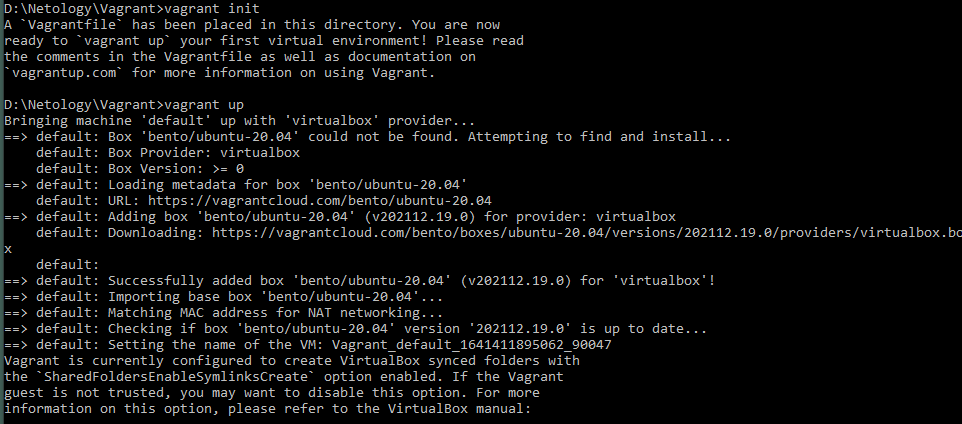  


**2. Установите ufw и разрешите к этой машине сессии на порты 22 и 443, при этом трафик на интерфейсе localhost (lo)
 должен ходить свободно на все порты.**  

`ufw` уже был установлен, я его настроил и включил:  
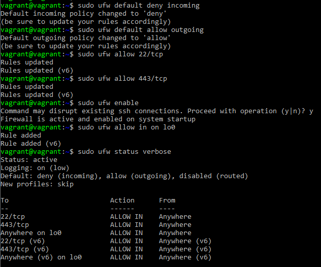  

**3. Установите hashicorp vault ([инструкция по ссылке](https://learn.hashicorp.com/tutorials/vault/getting-started-install?in=vault/getting-started#install-vault)).**  

Установил:
```bash
curl -fsSL https://apt.releases.hashicorp.com/gpg | sudo apt-key add -
sudo apt-add-repository "deb [arch=amd64] https://apt.releases.hashicorp.com $(lsb_release -cs) main"
sudo apt-get update && sudo apt-get install vault
```
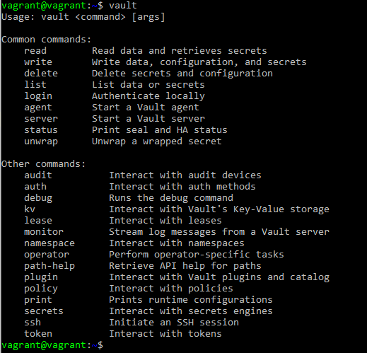  


**4. Cоздайте центр сертификации по инструкции ([ссылка](https://learn.hashicorp.com/tutorials/vault/pki-engine?in=vault/secrets-management)) и выпустите сертификат для использования его в настройке веб-сервера nginx (срок жизни сертификата - месяц).**  


Сделал (срок сертификата - 35 дней, чтобы с небольшим запасом перекрывать месяц):  
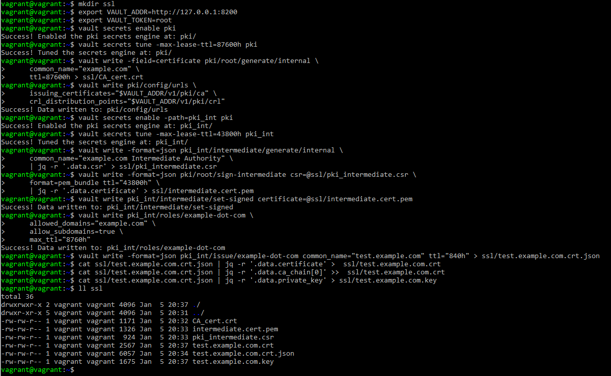

  
**5. Установите корневой сертификат созданного центра сертификации в доверенные в хостовой системе.**

Установил:       
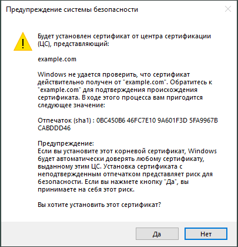  
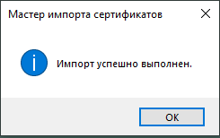  


**6. Установите nginx.**

Установил: `sudo apt-get install nginx`    
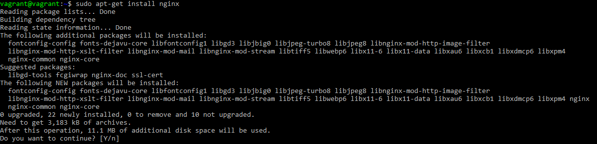  
...  
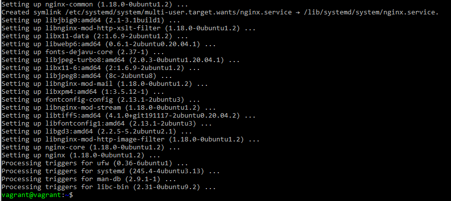  


**7. По инструкции ([ссылка](https://nginx.org/en/docs/http/configuring_https_servers.html)) настройте nginx на https, используя ранее подготовленный сертификат:**
  - **можно использовать стандартную стартовую страницу nginx для демонстрации работы сервера;**
  - **можно использовать и другой html файл, сделанный вами;**  

Настроил:    
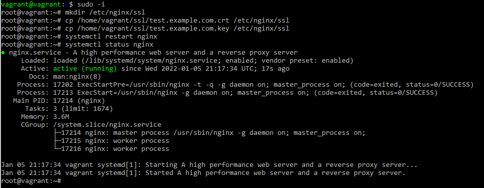  
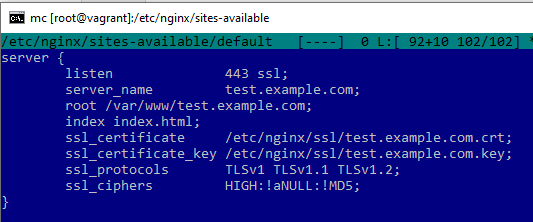  
  
**8. Откройте в браузере на хосте https адрес страницы, которую обслуживает сервер nginx.**  

Открыл:  
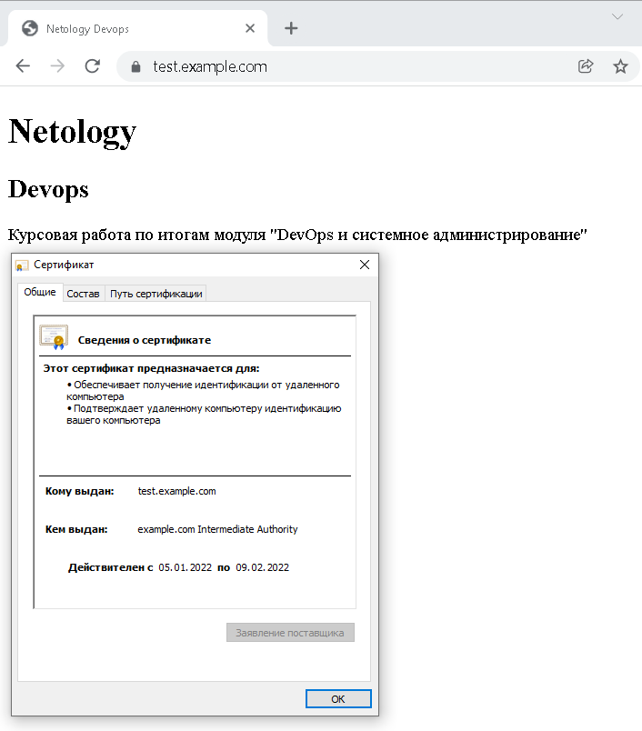  
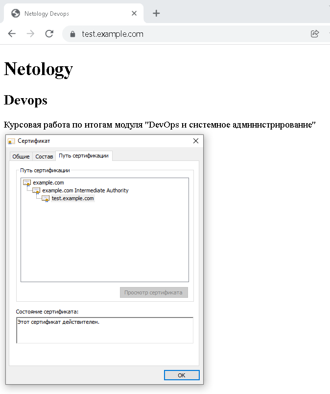  


**9. Создайте скрипт, который будет генерировать новый сертификат в vault:**
  - **генерируем новый сертификат так, чтобы не переписывать конфиг nginx;**
  - **перезапускаем nginx для применения нового сертификата.**

Скрипт:
```bash
#!/usr/bin/env bash

export VAULT_ADDR=http://127.0.0.1:8200
export VAULT_TOKEN=root

vault write -format=json pki_int/issue/example-dot-com common_name="test.example.com" ttl="840h" > /etc/nginx/ssl/test.example.com.crt.json

cat /etc/nginx/ssl/test.example.com.crt.json | jq -r '.data.certificate' >  /etc/nginx/ssl/test.example.com.crt
cat /etc/nginx/ssl/test.example.com.crt.json | jq -r '.data.ca_chain[0]' >> /etc/nginx/ssl/test.example.com.crt
cat /etc/nginx/ssl/test.example.com.crt.json | jq -r '.data.private_key' >  /etc/nginx/ssl/test.example.com.key
systemctl reload nginx
```

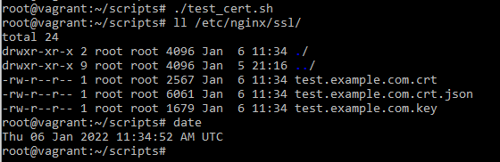   


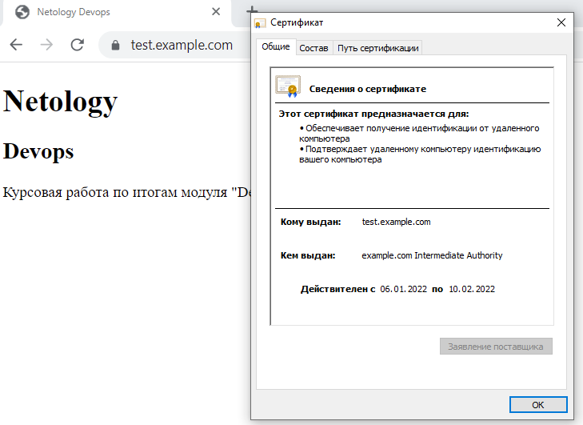  


**10. Поместите скрипт в crontab, чтобы сертификат обновлялся какого-то числа каждого месяца в удобное для вас время.**

Сделал:       
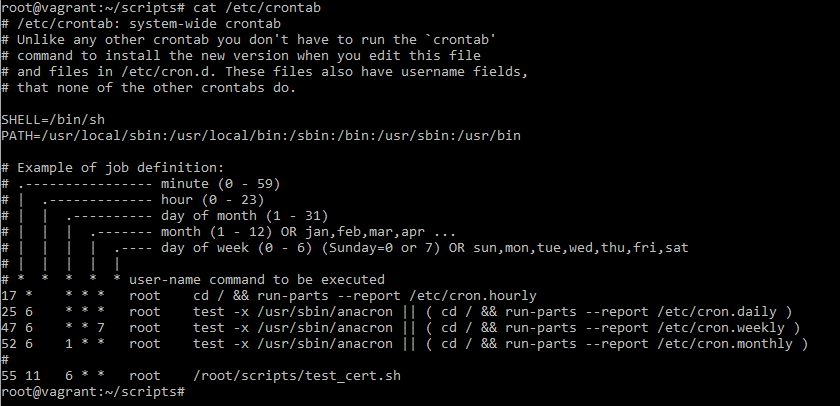  


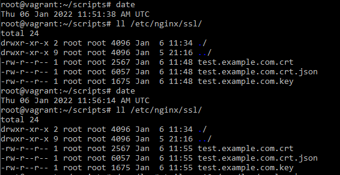  


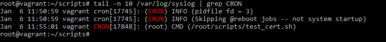  


 
