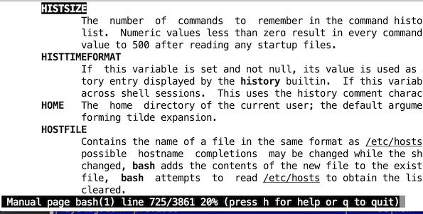
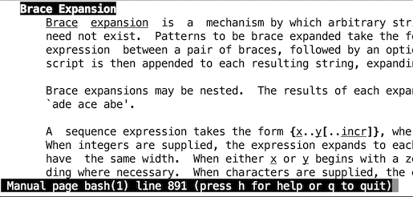
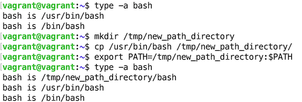
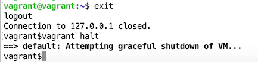

## Домашнее задание  "3.1. Работа в терминале, лекция 1"

**1. Установите средство виртуализации [Oracle VirtualBox](https://www.virtualbox.org/).**  
Установил:  


**2. Установите средство автоматизации [Hashicorp Vagrant](https://www.vagrantup.com/).**  
Установил:  


**3. В вашем основном окружении подготовьте удобный для дальнейшей работы терминал.**  
Оставил "родной" в Mac OS X.  
Ознакомился с кастомизацией PS1   


**4. С помощью базового файла конфигурации запустите Ubuntu 20.04 в VirtualBox посредством Vagrant.**   
Запустил:  


**5. Ознакомьтесь с графическим интерфейсом VirtualBox, посмотрите как выглядит виртуальная машина, **
которую создал для вас Vagrant, какие аппаратные ресурсы ей выделены. 
Какие ресурсы выделены по-умолчанию?**    
1 Гб оперативной памяти  
2 процессора  
64 Гб динамически расширяемый жёсткий диск  


**6. Ознакомьтесь с возможностями конфигурации VirtualBox через Vagrantfile: [документация](https://www.vagrantup.com/docs/providers/virtualbox/configuration.html). 
Как добавить оперативной памяти или ресурсов процессора виртуальной машине?**  
Редактиреем файл `Vargant`:
```bash
Vagrant.configure("2") do |config|
    config.vm.box = "bento/ubuntu-20.04"
    config.vm.provider "virtualbox" do |v|
	    v.memory = 2048
	    v.cpus = 2
    end
end
```


**7. Команда `vagrant ssh` из директории, в которой содержится Vagrantfile, позволит вам оказаться внутри виртуальной машины без каких-либо дополнительных настроек. 
Попрактикуйтесь в выполнении обсуждаемых команд в терминале Ubuntu.**   


**8. Ознакомиться с разделами `man bash`, почитать о настройках самого bash:**
  * __какой переменной можно задать длину журнала `history`, и на какой строчке manual это описывается?__  
 можно задать длину журнала переменной `ISTSIZE`  
 это описывается на `725-й` строке  *(у меня в терминале строки "гуляют" в зависимости от ширины окна)*


  * __что делает директива `ignoreboth` в bash?__  
  Директива `ignoreboth`  относится к параметру `HISTCONTROL`  и объединяетв в себе две дериктивы: `ignorespace` и `ignoredups` - 
в журнале не сохранятся строки, начинающиеся с пробела и дубликаты строк.  
  

**9. В каких сценариях использования применимы скобки `{}` и на какой строчке `man bash` это описано?**  
Это ипользуется для создания строк по шаблону, описывается на `891-й` строке:  `Brace Expansion`  
*(у меня в терминале строки "гуляют" в зависимости от ширины окна)*  


**10. Основываясь на предыдущем вопросе, как создать однократным вызовом `touch` 100000 файлов? 
А получилось ли создать 300000? Если нет, то почему?**  
100000 файлов получилось:
```bash
vagrant@vagrant:~/thousands_of_them$ touch f{1..100000}
vagrant@vagrant:~/thousands_of_them$ ls -1 | wc -l
100000
```
а 300000 - нет:
```bash
vagrant@vagrant:~/thousands_of_them$ touch f{1..300000}
-bash: /usr/bin/touch: Argument list too long
```
Список аргументов слишком велик  


**11. В man bash поищите по `/\[\[`. Что делает конструкция `[[ -d /tmp ]]`**   
Возвращает `0 - истина` если `/tmp` существует и является директорией (каталогом), в противном случае, вернет `1 - ложь`


**12. Основываясь на знаниях о просмотре текущих (например, PATH) и установке новых переменных; командах,
которые мы рассматривали, добейтесь в выводе type -a bash в виртуальной машине наличия первым пунктом в списке:**

     ```bash
     bash is /tmp/new_path_directory/bash
     bash is /usr/local/bin/bash
     bash is /bin/bash
     ```

     (прочие строки могут отличаться содержимым и порядком)
     В качестве ответа приведите команды, которые позволили вам добиться указанного вывода или соответствующие скриншоты.

```bash
vagrant@vagrant:~$ type -a bash
bash is /usr/bin/bash
bash is /bin/bash
vagrant@vagrant:~$ mkdir /tmp/new_path_directory
vagrant@vagrant:~$ cp /usr/bin/bash /tmp/new_path_directory/
vagrant@vagrant:~$ export PATH=/tmp/new_path_directory:$PATH
vagrant@vagrant:~$ type -a bash
bash is /tmp/new_path_directory/bash
bash is /usr/bin/bash
bash is /bin/bash
vagrant@vagrant:~$ 
```


**13. Чем отличается планирование команд с помощью `batch` и `at`?**  
И `batch` и `at` запускают задачу в определенное время, но `batch` выполнит задачу, только если средняя загрузка системы 
меньше 1.5 (можно настроить с помощью `atd`)

**14. Завершите работу виртуальной машины чтобы не расходовать ресурсы компьютера и/или батарею ноутбука.**  
Завершил:  

 