## Домашнее задание к занятию "3.2. Работа в терминале, лекция 2"

**1. Какого типа команда `cd`? Попробуйте объяснить, почему она именно такого типа;
 опишите ход своих мыслей, если считаете что она могла бы быть другого типа.** 

`cd` - внутренняя команда  
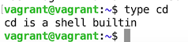

Можно написать внешнюю программу, которая бы меняла переменную `PWD`, но отдельно от `bash`, на мой взгляд,
в ней не было бы особого смысла.  

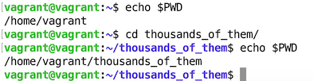

**2. Какая альтернатива без pipe команде `grep <some_string> <some_file> | wc -l`? `man grep` поможет в ответе на этот вопрос.
Ознакомьтесь с [документом](http://www.smallo.ruhr.de/award.html) о других подобных некорректных вариантах использования pipe.**  
Альтернатива  - `grep` с параметром `-c`  


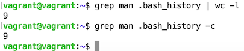


**3. Какой процесс с PID `1` является родителем для всех процессов в вашей виртуальной машине Ubuntu 20.04?**  
В Ubuntu 20.04 родителем для всех процессов является `systemd`  
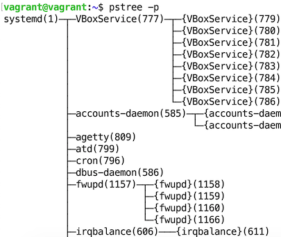


**4. Как будет выглядеть команда, которая перенаправит вывод stderr `ls` на другую сессию терминала?**  
`ls -l \root 2>/dev/pts/1`  

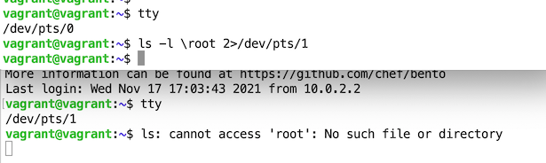


**5. Получится ли одновременно передать команде файл на stdin и вывести ее stdout в другой файл? Приведите работающий пример.**  
```bash
vagrant@vagrant:~$ echo -e "Devops\nNetology" > file_1
vagrant@vagrant:~$ cat file_1
Devops
Netology
vagrant@vagrant:~$ cat <file_1 >file_2
vagrant@vagrant:~$ cat file_2
Devops
Netology
```


**6. Получится ли находясь в графическом режиме, вывести данные из PTY в какой-либо из эмуляторов TTY? Сможете ли вы наблюдать выводимые данные?**  

Получится из под суперпользователя:  
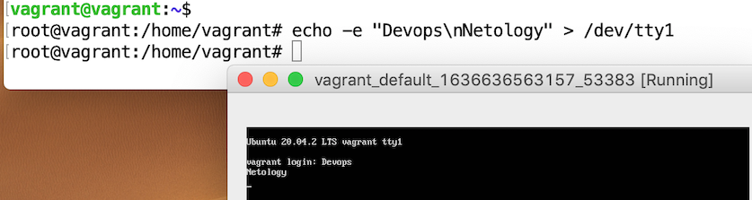

**7. Выполните команду `bash 5>&1`. К чему она приведет? Что будет, если вы выполните `echo netology > /proc/$$/fd/5`?
Почему так происходит?**  
Создается файловый дескриптор 5 и перенаправляется на stdout (файловый дескриптор - 1)  
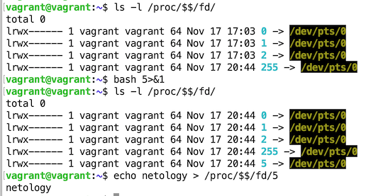


**8. Получится ли в качестве входного потока для pipe использовать только stderr команды, не потеряв при этом отображение stdout на pty? Напоминаем: по умолчанию через pipe передается только stdout команды слева от `|` на stdin команды справа.
Это можно сделать, поменяв стандартные потоки местами через промежуточный новый дескриптор, который вы научились создавать в предыдущем вопросе.**   
"Нормальное" поведение - `stdout` уходит в `pipe` и обрабатывается `sed` (меняет `folder` на `FOLDER`), а `stderr` выводится на `pty`:
```bash
vagrant@vagrant:~$ ls -d ./test_folder ./test_folder_0 | sed s/folder/FOLDER/  
ls: cannot access './test_folder_0': No such file or directory  
./test_FOLDER  
```
Меняем `stdout` и `stderr` местами:  
```bash
vagrant@vagrant:~$ ls -d ./test_folder ./test_folder_0 33>&2 2>&1 1>&33 | sed s/folder/FOLDER/
./test_folder
ls: cannot access './test_FOLDER_0': No such file or directory

```

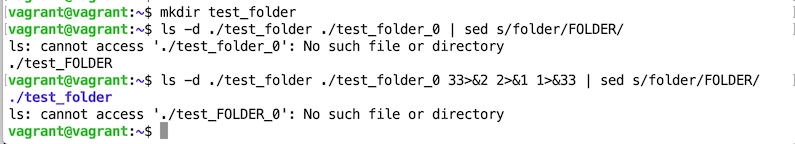

**9.Что выведет команда `cat /proc/$$/environ`? Как еще можно получить аналогичный по содержанию вывод?**  
Выведет переменные окружения.
Вместо неё можно воспользоваться `env` или `printenv`

**10. Используя `man`, опишите что доступно по адресам `/proc/<PID>/cmdline`, `/proc/<PID>/exe`.**  
`/proc/<PID>/cmdline` - содержит полную командную строку запуска прцесса  
`/proc/<PID>/exe` - символическая ссылка, содержащая актуальный путь к выполненной команде   


**11. Узнайте, какую наиболее старшую версию набора инструкций SSE поддерживает ваш процессор с помощью `/proc/cpuinfo`.**  
Версия SSE: 4.2  
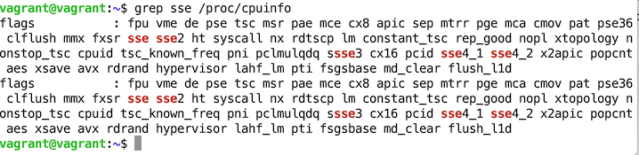


**12. При открытии нового окна терминала и `vagrant ssh` создается новая сессия и выделяется pty.
Это можно подтвердить командой `tty`, которая упоминалась в лекции 3.2. Однако:**  
```bash
vagrant@netology1:~$ ssh localhost 'tty'    
not a tty    
``` 
**Почитайте, почему так происходит, и как изменить поведение.**  
По умолчанию, при запуске команды на удаленном компьютере с помощью ssh, для удаленного сеанса TTY не выделяется.    
Для запуска TTY необходимо указать ключ `-t`:  
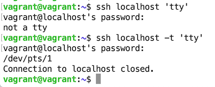

**13. Бывает, что есть необходимость переместить запущенный процесс из одной сессии в другую. Попробуйте сделать это, воспользовавшись `reptyr`.
Например, так можно перенести в `screen` процесс, который вы запустили по ошибке в обычной SSH-сессии.**  
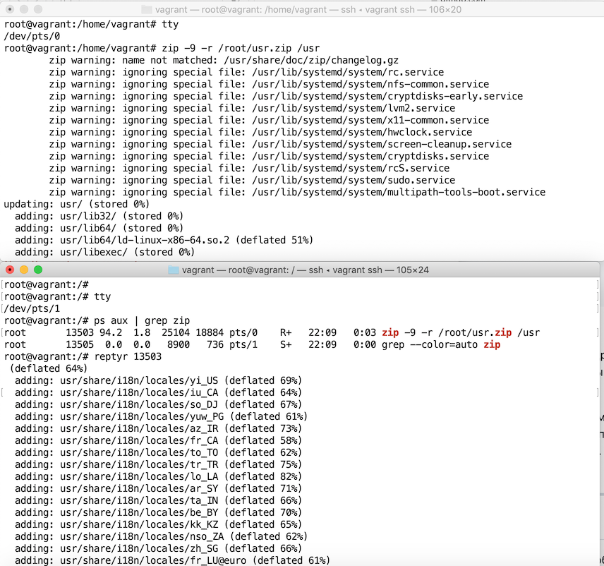

**14. `sudo echo string > /root/new_file` не даст выполнить перенаправление под обычным пользователем, так как перенаправлением занимается процесс shell'а, который запущен без `sudo` под вашим пользователем. Для решения данной проблемы можно использовать конструкцию `echo string | sudo tee /root/new_file`.
Узнайте что делает команда `tee` и почему в отличие от `sudo echo` команда с `sudo tee` будет работать.**  
Команда `tee` читает из стандартного ввода и записывает как в стандартный вывод, так и в один или несколько файлов одновременно.  
Так как `tee` запускается от имени суперпользователя, то ошибка не возникает.