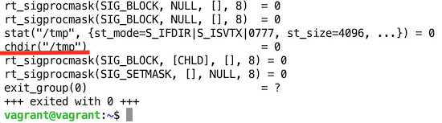
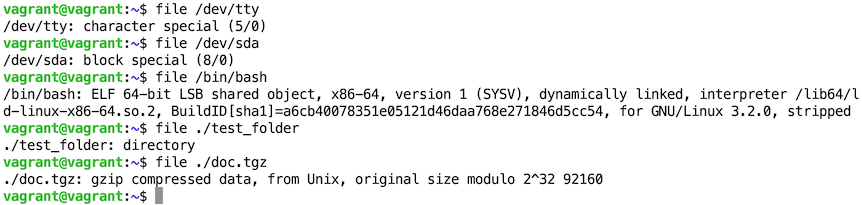
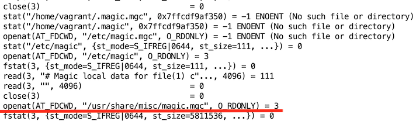
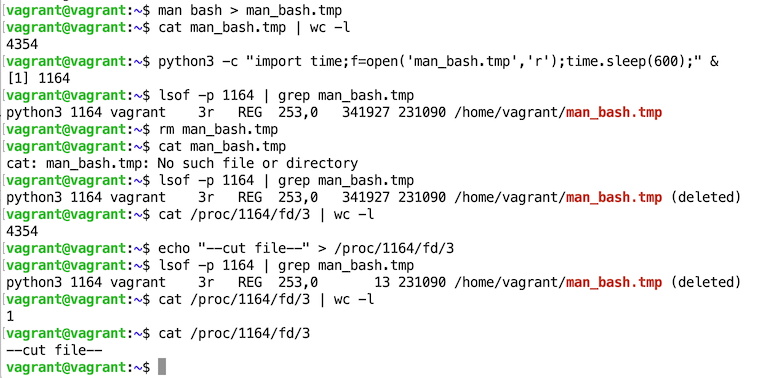
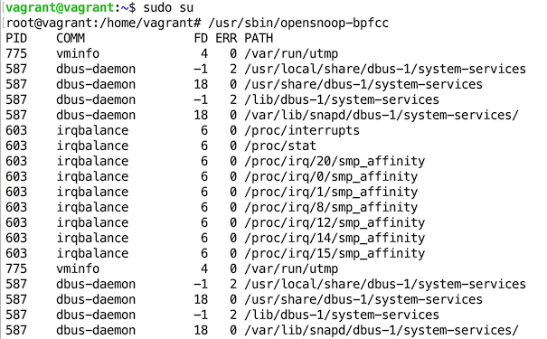
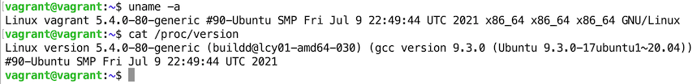
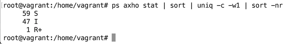

## Домашнее задание к занятию "3.3. Операционные системы, лекция 1"

**1. Какой системный вызов делает команда `cd`? В прошлом ДЗ мы выяснили, что `cd` не является самостоятельной  программой, это `shell builtin`, поэтому запустить `strace` непосредственно на `cd` не получится.
Тем не менее, вы можете запустить `strace` на `/bin/bash -c 'cd /tmp'`.
В этом случае вы увидите полный список системных вызовов, которые делает сам `bash` при старте.
Вам нужно найти тот единственный, который относится именно к `cd`.**  
`chdir("/tmp")                           = 0`




**2. Попробуйте использовать команду `file` на объекты разных типов на файловой системе. Например:** 
```bash
    vagrant@netology1:~$ file /dev/tty
    /dev/tty: character special (5/0)
    vagrant@netology1:~$ file /dev/sda
    /dev/sda: block special (8/0)
    vagrant@netology1:~$ file /bin/bash
    /bin/bash: ELF 64-bit LSB shared object, x86-64
```
**Используя `strace` выясните, где находится база данных `file` на основании которой она делает свои догадки.**



База данных `file` находится в файле: `/usr/share/misc/magic.mgc`



**3. Предположим, приложение пишет лог в текстовый файл. Этот файл оказался удален (deleted в lsof),
однако возможности сигналом сказать приложению переоткрыть файлы или просто перезапустить приложение – нет.
Так как приложение продолжает писать в удаленный файл, место на диске постепенно заканчивается. 
 Основываясь на знаниях о перенаправлении потоков предложите способ обнуления открытого удаленного файла
(чтобы освободить место на файловой системе).**  

Можно записать пустую строку в `/proc/<PID>/fd/<descriptor>`, где  
PID - PID процесса, открывшего файл  
descriptor - дескриптор открытого файла



**4. Занимают ли зомби-процессы какие-то ресурсы в ОС (CPU, RAM, IO)?**  
Нет. Зомби-процесс освобождает все свои ресурсы, но блокируют записи в таблице процессов.
Так как, зомби-процесс - это завершенный процесс, не проинформировавший процесс-родитель о своём завершении.


**5. В iovisor BCC есть утилита `opensnoop`:**  
```bash
    root@vagrant:~# dpkg -L bpfcc-tools | grep sbin/opensnoop  
    /usr/sbin/opensnoop-bpfcc
 ```
**На какие файлы вы увидели вызовы группы `open` за первую секунду работы утилиты?
Воспользуйтесь пакетом `bpfcc-tools` для Ubuntu 20.04.
Дополнительные [сведения по установке](https://github.com/iovisor/bcc/blob/master/INSTALL.md).**  




**6. Какой системный вызов использует `uname -a`? Приведите цитату из man по этому системному вызову,
где описывается альтернативное местоположение в `/proc`, где можно узнать версию ядра и релиз ОС.**  

Можно воспользоваться `cat /proc/version`



Из `man 2 uname`:  
`Part of the utsname information is also accessible via /proc/sys/kernel/{ostype, hostname, osrelease, version,  domain‐name}.`

Из `man proc`:
```
 /proc/version
    This string identifies the kernel version that is currently running.  
    It includes the contents of /proc/sys/ker‐nel/ostype, /proc/sys/kernel/osrelease and /proc/sys/kernel/version.  
    For example:
        Linux version 1.0.9 (quinlan@phaze) #1 Sat May 14 01:51:54 EDT 1994
```

**7. Чем отличается последовательность команд через `;` и через `&&` в bash? Например:**  
```bash
    root@netology1:~# test -d /tmp/some_dir; echo Hi
    Hi
    root@netology1:~# test -d /tmp/some_dir && echo Hi
    root@netology1:~#
```
**Есть ли смысл использовать в bash `&&`, если применить `set -e`?** 

При использовании `;`, команды выполняются друг за другом, не завися от успеха выполнения предыдущей команды.  
При использовании `&&`, команда в последовательности будет выполнена только при успешном завершении (вернет 0) предыдущей команды

Если применить `set -e`, то смысла в применении `&&` нет, так как `set -e` прекращает выполнение скрипта если команда завершилась ошибкой


**8. Из каких опций состоит режим bash `set -euxo pipefail` и почему его хорошо было бы использовать в сценариях?**  
Этот режим повысит безопасность выполнения bash-скрипта.  
`set -e` - прекращает выполнение скрипта если команда завершилась ошибкой.  
`set -u` - прекращает выполнение скрипта, если встретилась несуществующая переменная.  
`set -x` - выводит выполняемые команды в stdout перед выполненинем.  
`set -o pipefail` - прекращает выполнение скрипта, даже если одна из частей пайпа завершилась ошибкой.  


**9. Используя `-o stat` для `ps`, определите, какой наиболее часто встречающийся статус у процессов в системе.
 В `man ps` ознакомьтесь (`/PROCESS STATE CODES`) что значат дополнительные к основной заглавной буквы статуса процессов. 
 Его можно не учитывать при расчете (считать S, Ss или Ssl равнозначными).**  
Чаще всего встречается статус `S` - прерываемый сон (ожидает событие для выполнения) interruptible sleep (waiting for an event to complete)



Дополнительные статусы:  
`<` -     high-priority (not nice to other users)  
`N` -     low-priority (nice to other users)  
`L` -     has pages locked into memory (for real-time and custom IO)  
`s` -     is a session leader  
`l` -     is multi-threaded (using CLONE_THREAD, like NPTL pthreads do)  
`+` -     is in the foreground process group  
