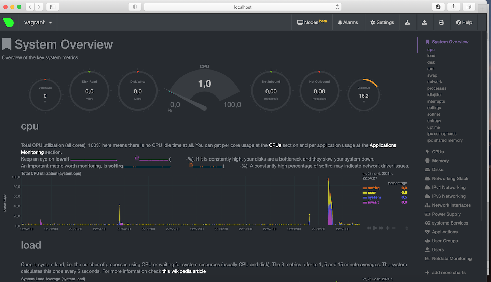

## Домашнее задание к занятию "3.4. Операционные системы, лекция 2"

1. __На лекции мы познакомились с [node_exporter](https://github.com/prometheus/node_exporter/releases).
 В демонстрации его исполняемый файл запускался в background.
 Этого достаточно для демо, но не для настоящей production-системы, где процессы должны находиться под внешним управлением.
 Используя знания из лекции по systemd, создайте самостоятельно простой [unit-файл](https://www.freedesktop.org/software/systemd/man/systemd.service.html) для node_exporter:__  

    * __поместите его в автозагрузку,__
    * __предусмотрите возможность добавления опций к запускаемому процессу через внешний файл (посмотрите, например, на `systemctl cat cron`),__
    * __удостоверьтесь, что с помощью systemctl процесс корректно стартует, завершается, а после перезагрузки автоматически поднимается.__

```bash
vagrant@vagrant:~$ sudo -i
root@vagrant:~# wget https://github.com/prometheus/node_exporter/releases/download/v1.3.0/node_exporter-1.3.0.linux-amd64.tar.gz
root@vagrant:~# tar xvfz node_exporter-1.3.0.linux-amd64.tar.gz
root@vagrant:~# mv ./node_exporter-1.3.0.linux-amd64 /opt/
root@vagrant:~# ln -s /opt/node_exporter-1.3.0.linux-amd64/node_exporter /usr/bin
root@vagrant:~# 
root@vagrant:~# cat > /etc/systemd/system/node_exporter.service
[Unit]
Description=Node Exporter

[Service]
EnvironmentFile=-/etc/default/node_exporter
ExecStart=/usr/bin/node_exporter $OPTIONS

[Install]
WantedBy=default.target
root@vagrant:~# 
root@vagrant:~# echo 'OPTIONS="--log.level=info"' > /etc/default/node_exporter
root@vagrant:~#
root@vagrant:~# systemctl daemon-reload
root@vagrant:~# systemctl start node_exporter
root@vagrant:~# systemctl enable node_exporter.service
Created symlink /etc/systemd/system/default.target.wants/node_exporter.service → /etc/systemd/system/node_exporter.service.
````
node_exporter корректно стартует, завершается, а после перезагрузки автоматически поднимается.


 


2. **Ознакомьтесь с опциями node_exporter и выводом `/metrics` по-умолчанию.
Приведите несколько опций, которые вы бы выбрали для базового мониторинга хоста по CPU, памяти, диску и сети.**   


CPU
```
node_cpu_seconds_total{cpu="0",mode="idle"}
node_cpu_seconds_total{cpu="0",mode="system"}
node_cpu_seconds_total{cpu="0",mode="user"}
```
Память:
```
node_memory_MemFree_bytes
node_memory_SwapFree_bytes 
```
Диск:
```
node_disk_io_time_seconds_total{device="sda"} 
node_disk_read_bytes_total{device="sda"} 
node_disk_read_time_seconds_total{device="sda"} 
node_disk_write_time_seconds_total{device="sda"} 
node_disk_written_bytes_total{device="sda"} 
```
Сеть:
```
node_network_receive_bytes_total{device="eth0"} 
node_network_receive_errs_total{device="eth0"} 
node_network_transmit_bytes_total{device="eth0"} 
node_network_transmit_errs_total{device="eth0"} 
```


3. __Установите в свою виртуальную машину [Netdata](https://github.com/netdata/netdata). Воспользуйтесь [готовыми пакетами](https://packagecloud.io/netdata/netdata/install) для установки (`sudo apt install -y netdata`). После успешной установки:__  
    * __в конфигурационном файле `/etc/netdata/netdata.conf` в секции [web] замените значение с localhost на `bind to = 0.0.0.0`,__
    * __добавьте в Vagrantfile проброс порта Netdata на свой локальный компьютер и сделайте `vagrant reload`:__

    ```bash
    config.vm.network "forwarded_port", guest: 19999, host: 19999
    ```

    **После успешной перезагрузки в браузере *на своем ПК* (не в виртуальной машине) вы должны суметь зайти на `localhost:19999`. Ознакомьтесь с метриками, которые по умолчанию собираются Netdata и с комментариями, которые даны к этим метрикам.**  

Ознакомился:  



4. **Можно ли по выводу `dmesg` понять, осознает ли ОС, что загружена не на настоящем оборудовании, а на системе виртуализации?**  
Можно  


5. **Как настроен sysctl `fs.nr_open` на системе по-умолчанию? Узнайте, что означает этот параметр. Какой другой существующий лимит не позволит достичь такого числа (`ulimit --help`)?**

`fs.nr_open` - определяет максимальное количества дескрипторов файлов, которое может быть выделено процессу.  
Значение по умолчанию - 1048576 (1024*1024)  


Превысить его не позволит `ulimit -n` - the maximum number of open file descriptors  


6. __Запустите любой долгоживущий процесс (не `ls`, который отработает мгновенно, а, например, `sleep 1h`) в отдельном неймспейсе процессов;
покажите, что ваш процесс работает под PID 1 через `nsenter`. Для простоты работайте в данном задании под root (`sudo -i`).
Под обычным пользователем требуются дополнительные опции (`--map-root-user`) и т.д.__


7. __Найдите информацию о том, что такое `:(){ :|:& };:`. Запустите эту команду в своей виртуальной машине Vagrant с Ubuntu 20.04 (**это важно, поведение в других ОС не проверялось**).
Некоторое время все будет "плохо", после чего (минуты) – ОС должна стабилизироваться.
Вызов `dmesg` расскажет, какой механизм помог автоматической стабилизации.
Как настроен этот механизм по-умолчанию, и как изменить число процессов, которое можно создать в сессии?__  

`fork-бомба` — вредоносная или ошибочно написанная программа, бесконечно создающая свои копии (системным вызовом fork()), которые обычно также начинают создавать свои копии и т. д.  
Выполнение такой программы может вызывать большую нагрузку вычислительной системы или даже отказ в обслуживании вследствие нехватки системных ресурсов (дескрипторов процессов, памяти, процессорного времени), что и является целью.


Можно изменить командой `ulimit -u <число процессов>`  
