## Домашнее задание к занятию "3.6. Компьютерные сети, лекция 1" 

1. **Работа c HTTP через телнет.**
- **Подключитесь утилитой телнет к сайту stackoverflow.com**  
`telnet stackoverflow.com 80`
- **отправьте HTTP запрос**  
```bash
GET /questions HTTP/1.0
HOST: stackoverflow.com
[press enter]
[press enter]
```
- **В ответе укажите полученный HTTP код, что он означает?**  

Получен HTTP-код: 301 Moved Permanently  
Код состояния HTTP 301 или Moved Permanently («Перемещено навсегда») — стандартный код ответа HTTP, получаемый в ответ от сервера в ситуации,
когда запрошенный ресурс был на постоянной основе перемещён в новое месторасположение, и указывающий на то, что текущие ссылки,
использующие данный URL, должны быть обновлены.  
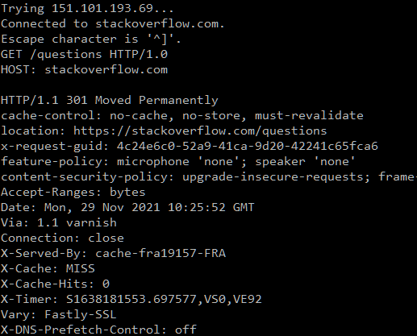

2. **Повторите задание 1 в браузере, используя консоль разработчика F12.**
- **откройте вкладку `Network`**
- **отправьте запрос http://stackoverflow.com**
- **найдите первый ответ HTTP сервера, откройте вкладку `Headers`**
- **укажите в ответе полученный HTTP код.**
- **проверьте время загрузки страницы, какой запрос обрабатывался дольше всего?**
- **приложите скриншот консоли браузера в ответ.**

Первый ответ: `301 Moved Permanently`   
Страница грузилась: `1.22 сек`  
Дольше всего, `1.22 сек`, обрабатывался запрос:  
`POST https://stats.g.doubleclick.net/j/collect?t=dc&aip=1&_r=3&v=1&_v=j96&tid=UA-108242619-1&cid=1053101537.1638180284&jid=2063299452&gjid=1547228075&_gid=1466936337.1638180284&_u=QCCACEAABAAAAC~&z=447280642`   
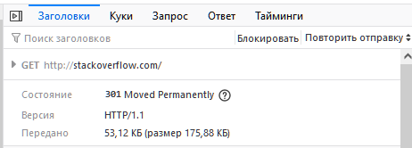   
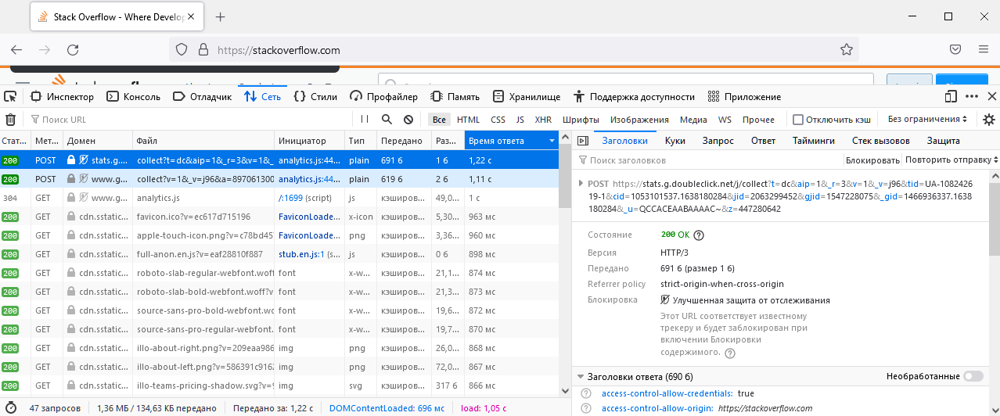   

3. **Какой IP адрес у вас в интернете?**  
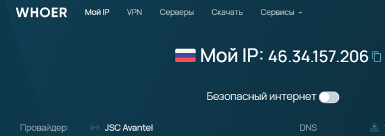


4. **Какому провайдеру принадлежит ваш IP адрес? Какой автономной системе AS? Воспользуйтесь утилитой `whois`**   
Ппровайдер: `JSC Avantel`  
AS: `AS25227`  
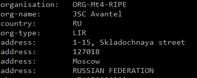   
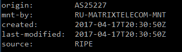   

5. **Через какие сети проходит пакет, отправленный с вашего компьютера на адрес 8.8.8.8? Через какие AS? Воспользуйтесь утилитой `traceroute`**  
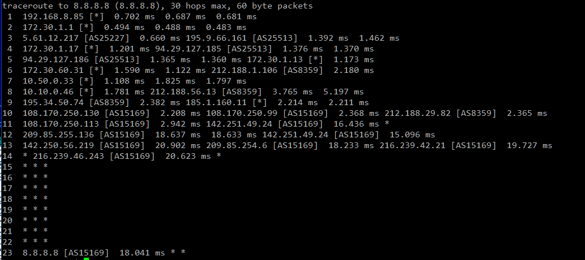   

6. **Повторите задание 5 в утилите `mtr`. На каком участке наибольшая задержка - delay?**  
Наиболшьшая задкржка на участке: `94.29.127.185 (AS25513) - 212.188.1.106 (AS8359)`  
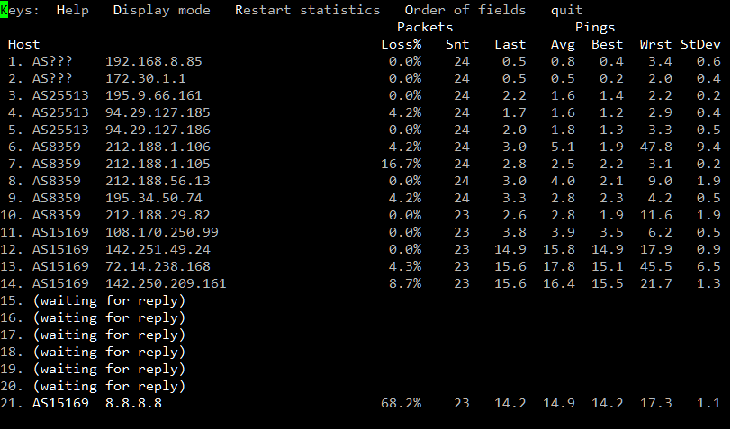   
   
7. **Какие DNS сервера отвечают за доменное имя dns.google? Какие A записи? воспользуйтесь утилитой `dig`**  
DNS сервера:  
`ns1.zdns.google.`  
`ns2.zdns.google.`  
`ns3.zdns.google.`  
`ns4.zdns.google.`  
A-записи dns.google  
`dns.google.    8.8.8.8`  
`dns.google.    8.8.4.4`  
   

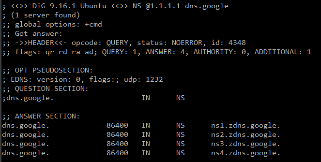   
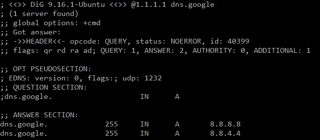   
   
   
8. **Проверьте PTR записи для IP адресов из задания 7. Какое доменное имя привязано к IP? воспользуйтесь утилитой `dig`**    
К `8.8.8.8` привязано имя `dns.google.`  
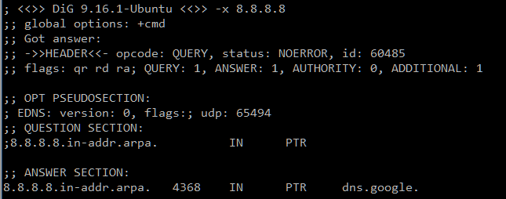 


