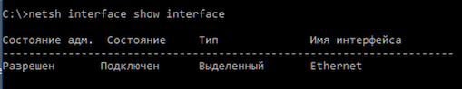
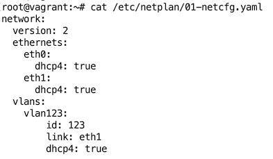
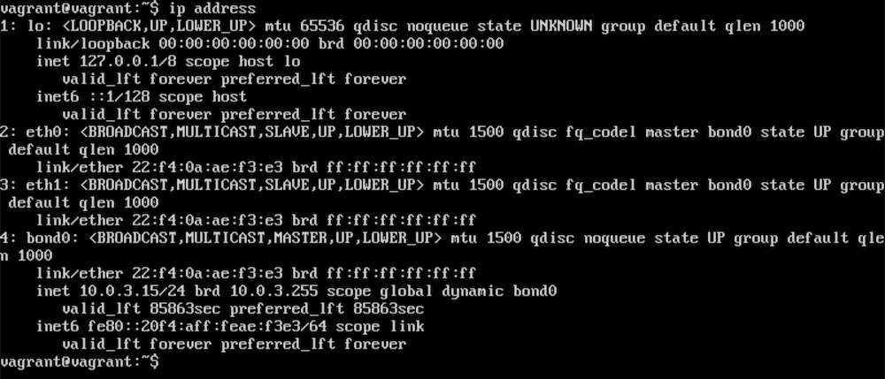

# Домашнее задание к занятию "3.7. Компьютерные сети, лекция 2"

1. **Проверьте список доступных сетевых интерфейсов на вашем компьютере. Какие команды есть для этого в Linux и в Windows?**  
Windows:  
`netsh interface show interface`    
  
Linux:  
`ip -br address`  
  
   

2. **Какой протокол используется для распознавания соседа по сетевому интерфейсу? Какой пакет и команды есть в Linux для этого?**  
Протокол: `LLDP`  
Пакет: `lldpd`  
Команды: `lldpctl`, `lldpcli`  

3. **Какая технология используется для разделения L2 коммутатора на несколько виртуальных сетей?
Какой пакет и команды есть в Linux для этого? Приведите пример конфига.**  
Технология `VLAN`  
Пакет: `vlan`  
Команды: `vconfig`, `ip`  
  
  

4. **Какие типы агрегации интерфейсов есть в Linux? Какие опции есть для балансировки нагрузки? Приведите пример конфига.**  
Агрегация интерфейсов - bonding  
Опции балансировки:  
* `balance-rr` - задействуются оба интерфейса по очереди, распределение пакетов по принципу Round Robin
* `active-backup` - используется только один интерфейс, второй активируется в случае неработоспособности первого
* `balance-xor` - задействуются оба интерфейса по очереди, распределение пакетов на основе политики хеширования xmit_hash_policy
* `broadcast` - задействуются оба интерфейса одновременно, пакеты передаются все интерфейсы
* `802.3ad` - задействуются оба интерфейса по очереди, распределение пакетов на основе политики хеширования xmit_hash_policy
* `balance-tlb` - задействуются оба интерфейса по очереди, пакеты распределяются в соответствии с текущей нагрузкой
  
  

5. **Сколько IP адресов в сети с маской /29 ? Сколько /29 подсетей можно получить из сети с маской /24.
Приведите несколько примеров /29 подсетей внутри сети 10.10.10.0/24.**  
Всего `8` IP адресов, из них `6` узловых.  
Можно получить `32` сети (2^5)  
Сети: `10.10.10.0/29`, `10.10.10.120/29`, `10.10.10.240/29`, `10.10.10.248/29`  

   
   
6. **Задача: вас попросили организовать стык между 2-мя организациями. Диапазоны 10.0.0.0/8, 172.16.0.0/12, 192.168.0.0/16 уже заняты. 
   Из какой подсети допустимо взять частные IP адреса? Маску выберите из расчета максимум 40-50 хостов внутри подсети.**  
Адреса выбираем из подсети `100.64.0.0 — 100.127.255.255`  
Маску выбираем `/26` - 62 хоста (маски /27 - недостаточно - 30 хостов)  
Например: `100.64.64.0/26`  
    
   
7. **Как проверить ARP таблицу в Linux, Windows? Как очистить ARP кеш полностью? Как из ARP таблицы удалить только один нужный IP?**   
Проверить ARP таблицу в Linux: `ip neigh`   
Проверить ARP таблицу в Windows: `arp -a`   
Очистить ARP кеш полностью в Linux: `ip neigh flush all`   
Очистить ARP кеш полностью в Windows: `netsh interface ip delete arpcache`  
Удалить из ARP таблицы только один IP в Linux: `ip neigh del <IP-адрес> dev <интерфейс>`  
Удалить из ARP таблицы только один IP в Windows: `arp -d <IP-адрес>`  
