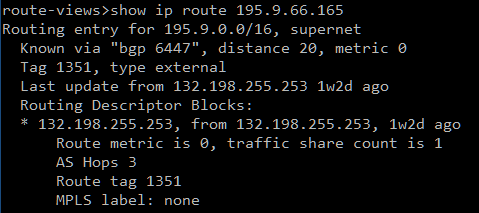
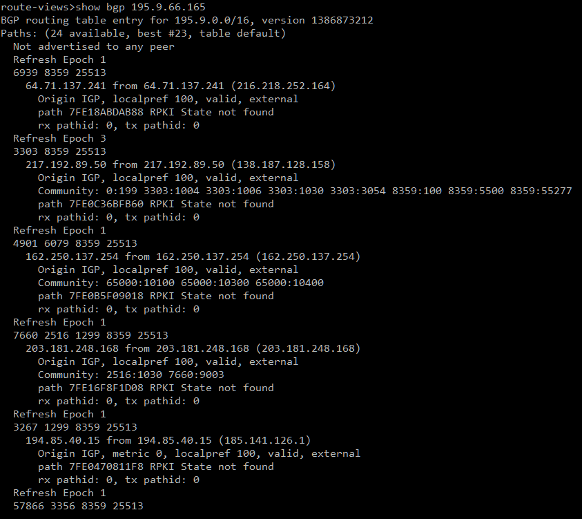
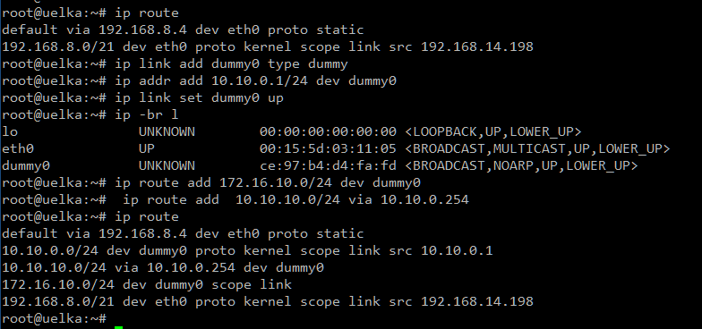
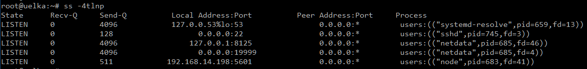
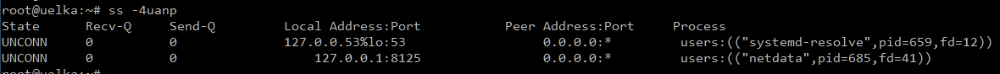
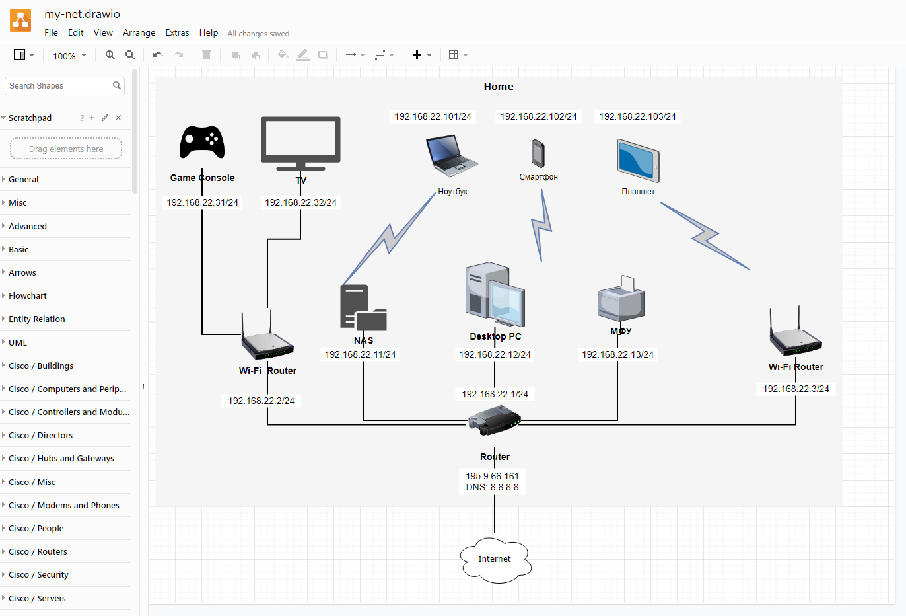

## Домашнее задание к занятию "3.8. Компьютерные сети, лекция 3"

1. **Подключитесь к публичному маршрутизатору в интернет. Найдите маршрут к вашему публичному IP**  
```
telnet route-views.routeviews.org
Username: rviews
show ip route x.x.x.x/32
show bgp x.x.x.x/32
```  
Подключился:  
  
  


2. **Создайте dummy0 интерфейс в Ubuntu. Добавьте несколько статических маршрутов. Проверьте таблицу маршрутизации.**  

  


3. **Проверьте открытые TCP порты в Ubuntu, какие протоколы и приложения используют эти порты? Приведите несколько примеров.**  
  `53/TCP` - systemd-resolved - кеширующий DNS-клиент    
  `22/TCP` - SSH-сервер      
  `8125/TCP` - NetData Performance Monitoring Tool   
  `19999/TCP` - Dashboard NetData Performance Monitoring Tool   
  `5601/TCP` - Kibana Dasboard   


   
4. **Проверьте используемые UDP сокеты в Ubuntu, какие протоколы и приложения используют эти порты?**  
  `53/UDP` - systemd-resolved - кеширующий DNS-клиент    
  `8125/UDP` - NetData Performance Monitoring Tool   
   

   
5. **Используя diagrams.net, создайте L3 диаграмму вашей домашней сети или любой другой сети, с которой вы работали.**     


 
