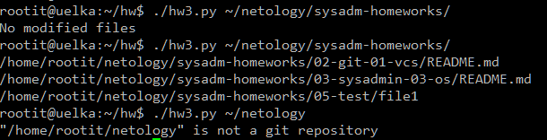
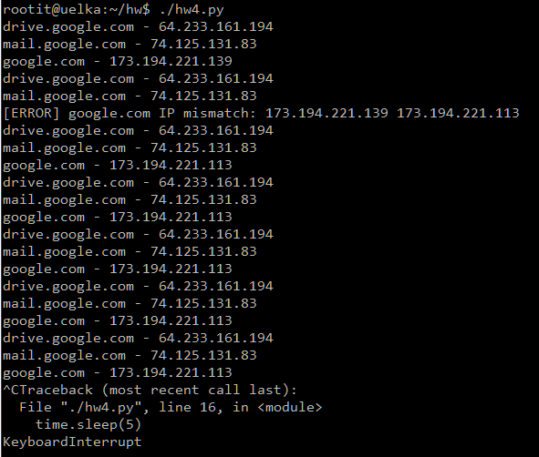

# Домашнее задание к занятию "4.2. Использование Python для решения типовых DevOps задач"

## Обязательная задача 1

Есть скрипт:
```python
#!/usr/bin/env python3
a = 1
b = '2'
c = a + b
```

### Вопросы:
| Вопрос  | Ответ |
| ------------- | ------------- |
| Какое значение будет присвоено переменной `c`?  | Никакое, упадет с ошибкой: `TypeError: unsupported operand type(s) for +: 'int' and 'str'` |
| Как получить для переменной `c` значение 12?  | `c = str(a) + b`  |
| Как получить для переменной `c` значение 3?  | `c = a + int(b)`  |

## Обязательная задача 2
Мы устроились на работу в компанию, где раньше уже был DevOps Engineer. Он написал скрипт, позволяющий узнать, какие файлы модифицированы в репозитории, относительно локальных изменений. Этим скриптом недовольно начальство, потому что в его выводе есть не все изменённые файлы, а также непонятен полный путь к директории, где они находятся. Как можно доработать скрипт ниже, чтобы он исполнял требования вашего руководителя?

```python
#!/usr/bin/env python3

import os

bash_command = ["cd ~/netology/sysadm-homeworks", "git status"]
result_os = os.popen(' && '.join(bash_command)).read()
is_change = False
for result in result_os.split('\n'):
    if result.find('modified') != -1:
        prepare_result = result.replace('\tmodified:   ', '')
        print(prepare_result)
        break
```

### Ваш скрипт:
```python
#!/usr/bin/env python3

import os
bash_command = ["cd ~/netology/sysadm-homeworks", "git status"]
result_os = os.popen(' && '.join(bash_command)).read()
repo_dir = os.path.expanduser(bash_command[0].replace("cd","").strip())
is_change = False
for result in result_os.split('\n'):
    if result.find('modified') != -1:
        prepare_result = os.path.join(repo_dir, result.replace('\tmodified:   ', ''))
        print(prepare_result)
        is_change = True
if not is_change:
    print('No modified files')

```

### Вывод скрипта при запуске при тестировании:
```
/home/rootit/netology/sysadm-homeworks/02-git-02-base/README.md
/home/rootit/netology/sysadm-homeworks/04-script-02-py/README.md
/home/rootit/netology/sysadm-homeworks/05-test/file1
```

## Обязательная задача 3
1. Доработать скрипт выше так, чтобы он мог проверять не только локальный репозиторий в текущей директории, а также умел воспринимать путь к репозиторию, который мы передаём как входной параметр. Мы точно знаем, что начальство коварное и будет проверять работу этого скрипта в директориях, которые не являются локальными репозиториями.

### Ваш скрипт:
```python
#!/usr/bin/env python3

import os
import sys

if len(sys.argv) > 1:
  repo_dir = sys.argv[1]
  if not os.path.isdir(repo_dir):
    print('"{}" is not directory'.format(repo_dir))
    sys.exit()
else:
  repo_dir = os.getcwd()
if not os.path.exists(os.path.join(repo_dir, '.git')):
  print('"{}" is not a git repository'.format(repo_dir))
  sys.exit()

bash_command = ["cd " + repo_dir, "git status"]
result_os = os.popen(' && '.join(bash_command)).read()
is_change = False
for result in result_os.split('\n'):
    if result.find('modified') != -1:
        prepare_result = os.path.join(repo_dir, result.replace('\tmodified:   ', ''))
        is_change = True
        print(prepare_result)
if not is_change:
    print('No modified files')
```

### Вывод скрипта при запуске при тестировании:
```
rootit@uelka:~/hw$ ./hw3.py ~/netology/sysadm-homeworks/
No modified files
rootit@uelka:~/hw$ ./hw3.py ~/netology/sysadm-homeworks/
/home/rootit/netology/sysadm-homeworks/02-git-01-vcs/README.md
/home/rootit/netology/sysadm-homeworks/03-sysadmin-03-os/README.md
/home/rootit/netology/sysadm-homeworks/05-test/file1
rootit@uelka:~/hw$ ./hw3.py ~/netology
"/home/rootit/netology" is not a git repository
rootit@uelka:~/hw$

```
  

## Обязательная задача 4
1. Наша команда разрабатывает несколько веб-сервисов, доступных по http. Мы точно знаем, что на их стенде нет никакой балансировки, кластеризации, за DNS прячется конкретный IP сервера, где установлен сервис. Проблема в том, что отдел, занимающийся нашей инфраструктурой очень часто меняет нам сервера, поэтому IP меняются примерно раз в неделю, при этом сервисы сохраняют за собой DNS имена. Это бы совсем никого не беспокоило, если бы несколько раз сервера не уезжали в такой сегмент сети нашей компании, который недоступен для разработчиков. Мы хотим написать скрипт, который опрашивает веб-сервисы, получает их IP, выводит информацию в стандартный вывод в виде: <URL сервиса> - <его IP>. Также, должна быть реализована возможность проверки текущего IP сервиса c его IP из предыдущей проверки. Если проверка будет провалена - оповестить об этом в стандартный вывод сообщением: [ERROR] <URL сервиса> IP mismatch: <старый IP> <Новый IP>. Будем считать, что наша разработка реализовала сервисы: `drive.google.com`, `mail.google.com`, `google.com`.

### Ваш скрипт:
```python
#!/usr/bin/env python3

import socket
import time

services = ['drive.google.com', 'mail.google.com', 'google.com']
ip_services = {}
while True:
    for service in services:
        ip = socket.gethostbyname(service)
        if ip_services.get(service, ip) == ip:
            print('{} - {}'.format(service, ip))
        else:
            print('[ERROR] {} IP mismatch: {} {}'.format(service, ip_services.get(service), ip))
        ip_services[service] = ip
    time.sleep(5)
```

### Вывод скрипта при запуске при тестировании:
```
rootit@uelka:~/hw$ ./hw4.py
drive.google.com - 64.233.161.194
mail.google.com - 74.125.131.83
google.com - 173.194.221.139
drive.google.com - 64.233.161.194
mail.google.com - 74.125.131.83
[ERROR] google.com IP mismatch: 173.194.221.139 173.194.221.113
drive.google.com - 64.233.161.194
mail.google.com - 74.125.131.83
google.com - 173.194.221.113
drive.google.com - 64.233.161.194
mail.google.com - 74.125.131.83
google.com - 173.194.221.113
drive.google.com - 64.233.161.194
mail.google.com - 74.125.131.83
google.com - 173.194.221.113
drive.google.com - 64.233.161.194
mail.google.com - 74.125.131.83
google.com - 173.194.221.113
drive.google.com - 64.233.161.194
mail.google.com - 74.125.131.83
google.com - 173.194.221.113
^CTraceback (most recent call last):
  File "./hw4.py", line 16, in <module>
    time.sleep(5)
KeyboardInterrupt
```
  

