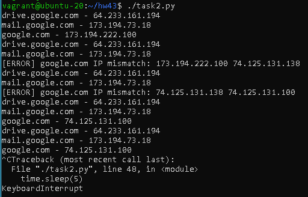
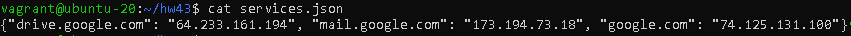
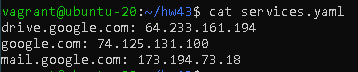

# Домашнее задание к занятию "4.3. Языки разметки JSON и YAML"


## Обязательная задача 1
Мы выгрузили JSON, который получили через API запрос к нашему сервису:
```
    { "info" : "Sample JSON output from our service\t",
        "elements" :[
            { "name" : "first",
            "type" : "server",
            "ip" : 7175 
            }
            { "name" : "second",
            "type" : "proxy",
            "ip : 71.78.22.43
            }
        ]
    }
```
  Нужно найти и исправить все ошибки, которые допускает наш сервис  

- Элементы массива должны быть разделены запятой.  
- Строка `"ip : 71.78.22.43` должна иметь вид: `"ip" : "71.78.22.43"`  
Ключ должен быть заключен в двойные кавычки и строковое значение должно быть заключено в двойные кавычки.  
*(т.к. ip-адрес не является ни числом, ни массивом, ни объектом и не имеет значения null, true или false, то он - строка)*
```json
    { "info" : "Sample JSON output from our service\t",
        "elements" :[
            { "name" : "first",
            "type" : "server",
            "ip" : 7175 
            }, 
            { "name" : "second",
            "type" : "proxy",
            "ip" : "71.78.22.43"
            }
        ]
    }
```


## Обязательная задача 2
В прошлый рабочий день мы создавали скрипт, позволяющий опрашивать веб-сервисы и получать их IP. К уже реализованному функционалу нам нужно добавить возможность записи JSON и YAML файлов, описывающих наши сервисы. Формат записи JSON по одному сервису: `{ "имя сервиса" : "его IP"}`. Формат записи YAML по одному сервису: `- имя сервиса: его IP`. Если в момент исполнения скрипта меняется IP у сервиса - он должен так же поменяться в yml и json файле.

### Ваш скрипт:
```python
#!/usr/bin/env python3

import os
import socket
import json
import yaml
import time

SERVICES_YAML_FILE = 'services.yaml'
SERVICES_JSON_FILE = 'services.json'

services = ['drive.google.com', 'mail.google.com', 'google.com']

if os.path.exists(SERVICES_JSON_FILE):
    with open(SERVICES_JSON_FILE, 'r') as js:
        try:
            json_dict = json.load(js)
        except:
            json_dict = {}
else:
    json_dict = {}

if os.path.exists(SERVICES_YAML_FILE):
    with open(SERVICES_YAML_FILE, 'r') as yml:
        try:
            yaml_dict = yaml.safe_load(yml)
        except:
            yaml_dict = {}
else:
    yaml_dict = {}

while True:
    for service in services:
        current_ip = socket.gethostbyname(service)
        last_ip = json_dict.get(service, yaml_dict.get(service, current_ip))
        if last_ip == current_ip:
            print('{} - {}'.format(service, current_ip))
        else:
            print('[ERROR] {} IP mismatch: {} {}'.format(service, last_ip, current_ip))
        json_dict[service] = current_ip
        yaml_dict[service] = current_ip

    with open(SERVICES_JSON_FILE, 'w') as js:
        js.write(json.dumps(json_dict))
    with open(SERVICES_YAML_FILE, 'w') as yml:
        yml.write(yaml.dump(yaml_dict))

    time.sleep(5)
```

### Вывод скрипта при запуске при тестировании:
```bash
vagrant@ubuntu-20:~/hw43$ ./task2.py
drive.google.com - 64.233.161.194
mail.google.com - 173.194.73.18
google.com - 173.194.222.100
drive.google.com - 64.233.161.194
mail.google.com - 173.194.73.18
[ERROR] google.com IP mismatch: 173.194.222.100 74.125.131.138
drive.google.com - 64.233.161.194
mail.google.com - 173.194.73.18
[ERROR] google.com IP mismatch: 74.125.131.138 74.125.131.100
drive.google.com - 64.233.161.194
mail.google.com - 173.194.73.18
google.com - 74.125.131.100
drive.google.com - 64.233.161.194
mail.google.com - 173.194.73.18
google.com - 74.125.131.100
^CTraceback (most recent call last):
  File "./task2.py", line 48, in <module>
    time.sleep(5)
KeyboardInterrupt
```
  

### json-файл(ы), который(е) записал ваш скрипт:
```json
{"drive.google.com": "64.233.161.194", "mail.google.com": "173.194.73.18", "google.com": "74.125.131.100"}
```


### yml-файл(ы), который(е) записал ваш скрипт:
```yaml
drive.google.com: 64.233.161.194
google.com: 74.125.131.100
mail.google.com: 173.194.73.18
```


