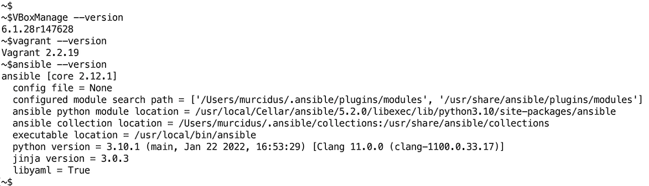
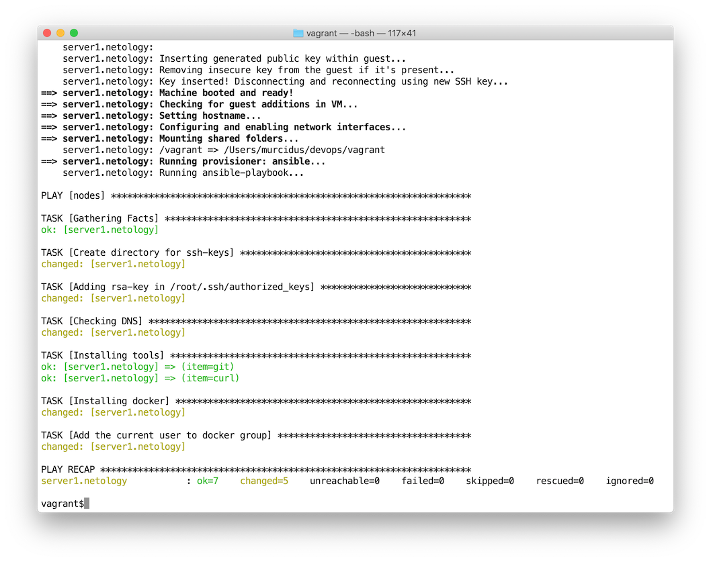
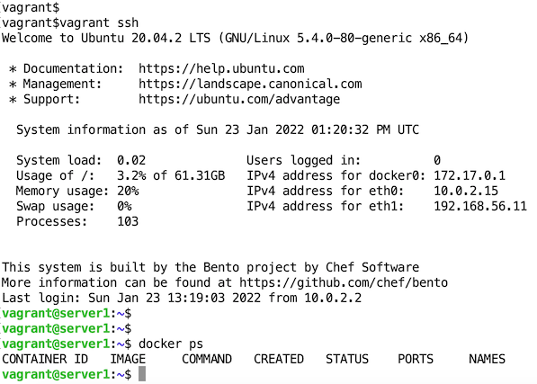

# Домашнее задание к занятию "5.2. Применение принципов IaaC в работе с виртуальными машинами"


---

## Задача 1

- **Опишите своими словами основные преимущества применения на практике IaaC паттернов.**  
  ускорение развёртывания и масштабирования тестовых и продакшн окружений;  
  стабильность конфигураций окружений, самодокументирование конфигураций, версионность;  
  ускорение разработки ПО.   
- **Какой из принципов IaaC является основополагающим?**  
  подход к процессу создания и настройки инфраструктуры аналогично процессу разработки ПО  
  и идемпотентность - получение одного и того же результата при повторном выполнении операции

## Задача 2

- **Чем Ansible выгодно отличается от других систем управление конфигурациями?**  
    Ansible не требует установки агентов или сертификатов (работает на текущей инфраструктуре), большое количество плагинов, написан на Python
- **Какой, на ваш взгляд, метод работы систем конфигурации более надёжный push или pull?**  
  push, на мой взгляд, более надежен, т.к. клиент может сразу получить обновление конфигурации с сервера 
  после её изменения и на сервере проще контролировать сбои: в случае pull можно не сразу узнать о произошедшем сбое в системе

## Задача 3

**Установить на личный компьютер:**

- **VirtualBox**
- **Vagrant**
- **Ansible**

__*Приложить вывод команд установленных версий каждой из программ, оформленный в markdown.*__

Установил:  
```bash
~$VBoxManage --version
6.1.28r147628
~$vagrant --version
Vagrant 2.2.19
~$ansible --version
ansible [core 2.12.1]
  config file = None
  configured module search path = ['/Users/murcidus/.ansible/plugins/modules', '/usr/share/ansible/plugins/modules']
  ansible python module location = /usr/local/Cellar/ansible/5.2.0/libexec/lib/python3.10/site-packages/ansible
  ansible collection location = /Users/murcidus/.ansible/collections:/usr/share/ansible/collections
  executable location = /usr/local/bin/ansible
  python version = 3.10.1 (main, Jan 22 2022, 16:53:29) [Clang 11.0.0 (clang-1100.0.33.17)]
  jinja version = 3.0.3
  libyaml = True
```



## Задача 4 (*)

**Воспроизвести практическую часть лекции самостоятельно.**

- **Создать виртуальную машину.**
- **Зайти внутрь ВМ, убедиться, что Docker установлен с помощью команды**  
```
docker ps
```

Создал:  



Убедился:
```bash
vagrant@server1:~$ docker ps
CONTAINER ID   IMAGE     COMMAND   CREATED   STATUS    PORTS     NAMES
vagrant@server1:~$ 
```



