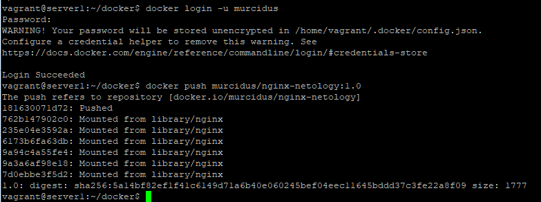
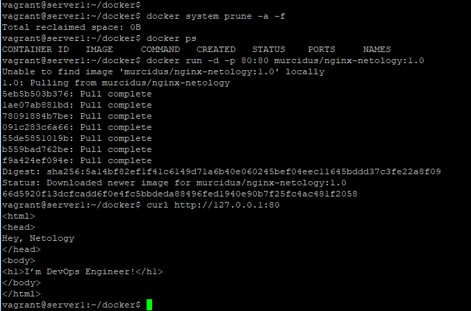
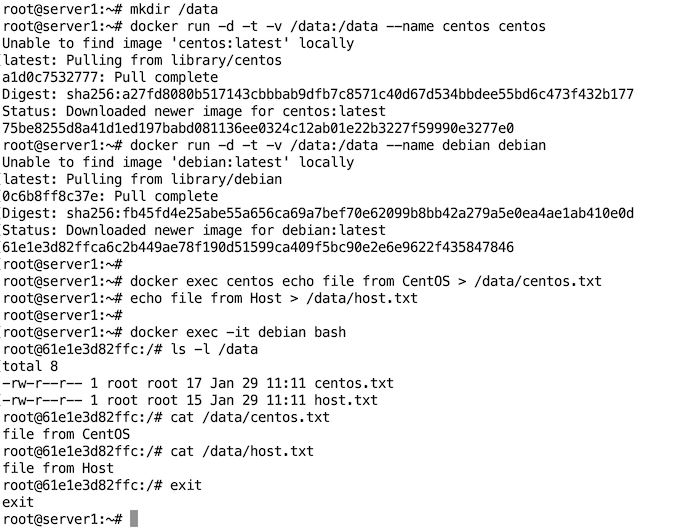
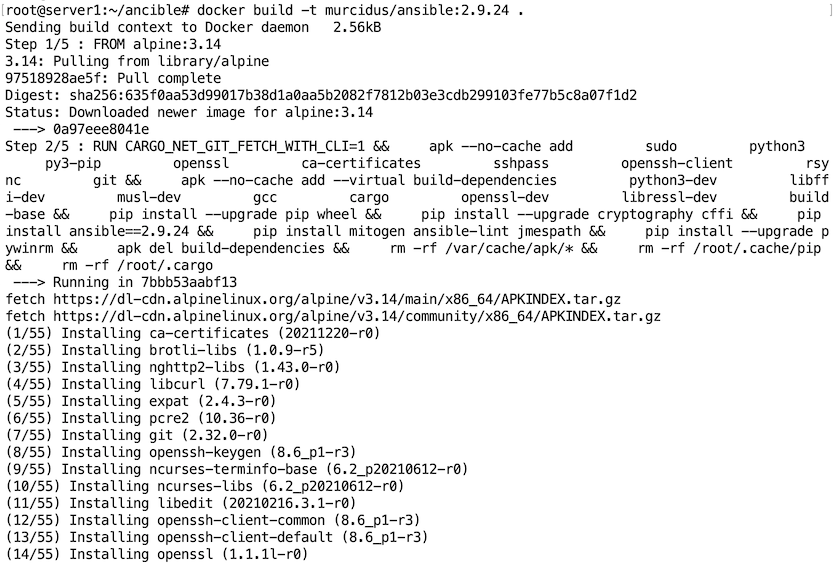
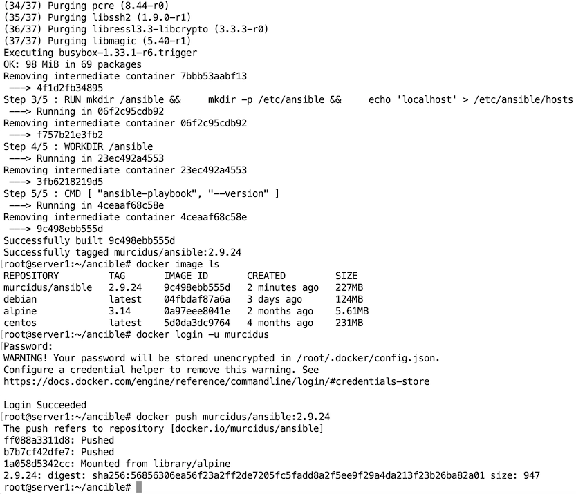
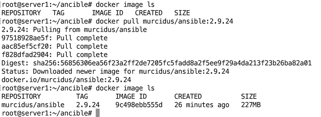

# Домашнее задание к занятию "5.3. Введение. Экосистема. Архитектура. Жизненный цикл Docker контейнера"

---

## Задача 1

**Сценарий выполения задачи:**  

- **создайте свой репозиторий на https://hub.docker.com;**
- **выберете любой образ, который содержит веб-сервер Nginx;**
- **создайте свой fork образа;**
- **реализуйте функциональность:**
**запуск веб-сервера в фоне с индекс-страницей, содержащей HTML-код ниже:**
```
<html>
<head>
Hey, Netology
</head>
<body>
<h1>I’m DevOps Engineer!</h1>
</body>
</html>
```
**Опубликуйте созданный форк в своем репозитории и предоставьте ответ в виде ссылки на https://hub.docker.com/username_repo.**

Сделал:  https://hub.docker.com/r/murcidus/nginx-netology



  



## Задача 2

**Посмотрите на сценарий ниже и ответьте на вопрос:**
**"Подходит ли в этом сценарии использование Docker контейнеров или лучше подойдет виртуальная машина, физическая машина? Может быть возможны разные варианты?"**

**Детально опишите и обоснуйте свой выбор.**

--

**Сценарий:**

- **Высоконагруженное монолитное java веб-приложение;**  
  Виртуальная или физическая машина (монолитное - наверняка большое и тяжёлое)
- **Nodejs веб-приложение;**  
  Docker (есть официальный образ на dockerhub)
- **Мобильное приложение c версиями для Android и iOS;**  
  Docker
- **Шина данных на базе Apache Kafka;**  
  Физическая машина
- **Elasticsearch кластер для реализации логирования продуктивного веб-приложения - три ноды elasticsearch, два logstash и две ноды kibana;**  
  Docker (есть официальный образ на dockerhub) или виртуальная машины на разных физических машинах 
- **Мониторинг-стек на базе Prometheus и Grafana;**  
  Виртуальная или физическая машина
- **MongoDB, как основное хранилище данных для java-приложения;**  
  Docker (есть официальный образ на dockerhub), физическая машина
- **Gitlab сервер для реализации CI/CD процессов и приватный (закрытый) Docker Registry.**  
  Виртуальная или физическая машина


С частью продуктов я знаком поверхностно, а о другой первый раз слышу. Решение принимал интуитивно и по наличию официального образа на dockerhub.

## Задача 3

- **Запустите первый контейнер из образа ***centos*** c любым тэгом в фоновом режиме, подключив папку ```/data``` из текущей рабочей директории на хостовой машине в ```/data``` контейнера;**
- **Запустите второй контейнер из образа ***debian*** в фоновом режиме, подключив папку ```/data``` из текущей рабочей директории на хостовой машине в ```/data``` контейнера;**
- **Подключитесь к первому контейнеру с помощью ```docker exec``` и создайте текстовый файл любого содержания в ```/data```;**
- **Добавьте еще один файл в папку ```/data``` на хостовой машине;**
- **Подключитесь во второй контейнер и отобразите листинг и содержание файлов в ```/data``` контейнера.**

Сделал:

```bash
root@server1:~# mkdir /data
root@server1:~# docker run -d -t -v /data:/data --name centos centos
Unable to find image 'centos:latest' locally
latest: Pulling from library/centos
a1d0c7532777: Pull complete 
Digest: sha256:a27fd8080b517143cbbbab9dfb7c8571c40d67d534bbdee55bd6c473f432b177
Status: Downloaded newer image for centos:latest
75be8255d8a41d1ed197babd081136ee0324c12ab01e22b3227f59990e3277e0
root@server1:~# docker run -d -t -v /data:/data --name debian debian
Unable to find image 'debian:latest' locally
latest: Pulling from library/debian
0c6b8ff8c37e: Pull complete 
Digest: sha256:fb45fd4e25abe55a656ca69a7bef70e62099b8bb42a279a5e0ea4ae1ab410e0d
Status: Downloaded newer image for debian:latest
61e1e3d82ffca6c2b449ae78f190d51599ca409f5bc90e2e6e9622f435847846
root@server1:~# 
root@server1:~# docker exec centos echo file from CentOS > /data/centos.txt
root@server1:~# echo file from Host > /data/host.txt
root@server1:~# 
root@server1:~# docker exec -it debian bash
root@61e1e3d82ffc:/# ls -l /data
total 8
-rw-r--r-- 1 root root 17 Jan 29 11:11 centos.txt
-rw-r--r-- 1 root root 15 Jan 29 11:11 host.txt
root@61e1e3d82ffc:/# cat /data/centos.txt 
file from CentOS
root@61e1e3d82ffc:/# cat /data/host.txt 
file from Host
root@61e1e3d82ffc:/# exit
exit
root@server1:~# 
```


## Задача 4 (*)

**Воспроизвести практическую часть лекции самостоятельно.**

**Соберите Docker образ с Ansible, загрузите на Docker Hub и пришлите ссылку вместе с остальными ответами к задачам.**  

Собрал:  https://hub.docker.com/r/murcidus/ansible/tags


   

...

    

...

    