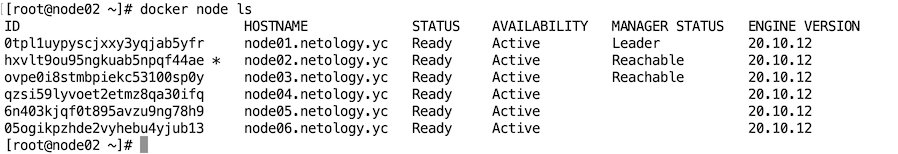
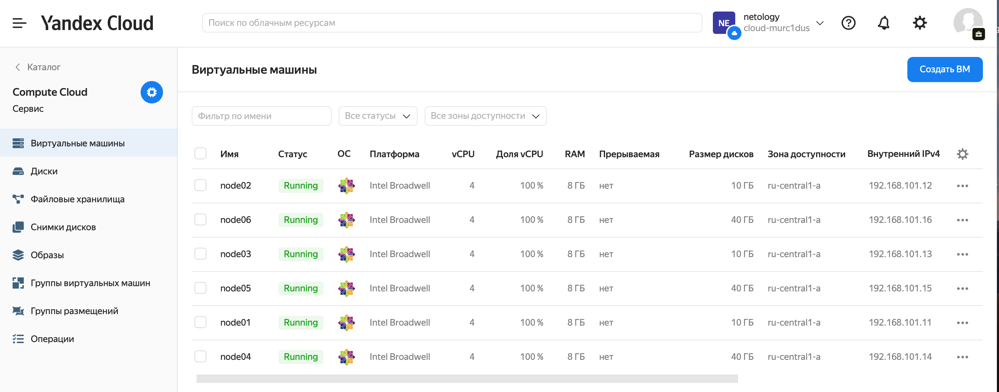
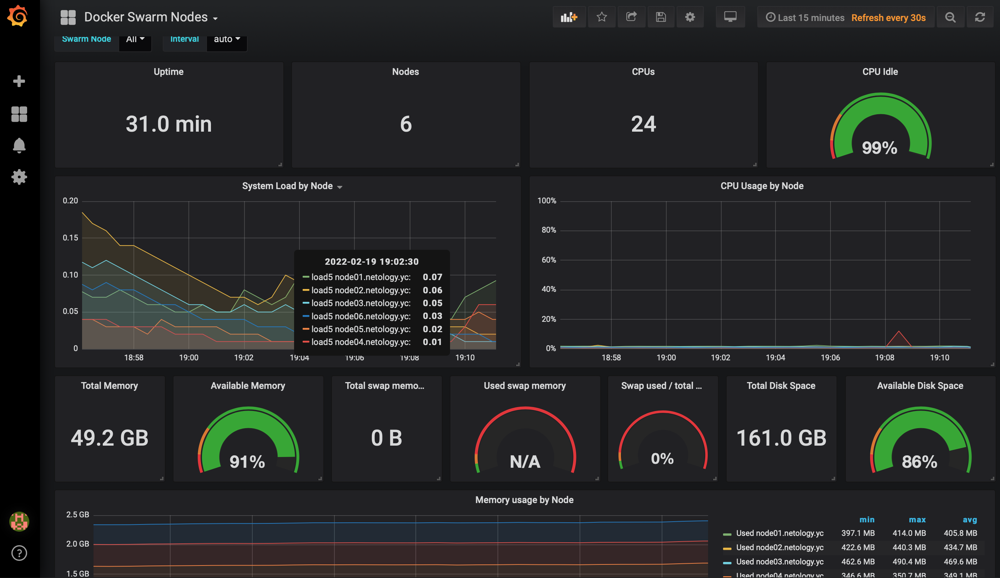
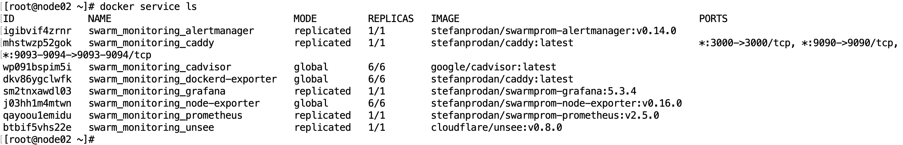
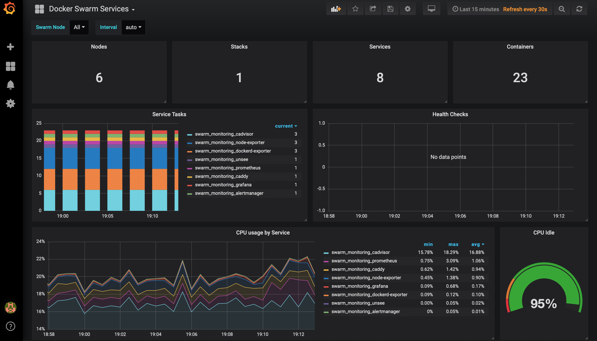

# Домашнее задание к занятию "5.5. Оркестрация кластером Docker контейнеров на примере Docker Swarm"

---

## Задача 1

**Дайте письменые ответы на следующие вопросы:**  

- **В чём отличие режимов работы сервисов в Docker Swarm кластере: replication и global?**  
  в режиме `global` сервис будет запущен на каждом узле,  
  в режиме `replication` сервис будет реплицирован согласно заданным параметрам, например командой `docker service update --replicas=3`
- **Какой алгоритм выбора лидера используется в Docker Swarm кластере?**  
  используется алгоритм Raft
- **Что такое Overlay Network?**  
 распределённая сеть, создаваемая поверх существующей, соединющая все контейнеры,
 позволяет всему кластеру использовать единое пространство имен DNS

## Задача 2

**Создать ваш первый Docker Swarm кластер в Яндекс.Облаке**

**Для получения зачета, вам необходимо предоставить скриншот из терминала (консоли), с выводом команды:**
```
docker node ls
```
Создал:  

  

```bash
[root@node02 ~]# docker node ls
ID                            HOSTNAME             STATUS    AVAILABILITY   MANAGER STATUS   ENGINE VERSION
0tpl1uypyscjxxy3yqjab5yfr     node01.netology.yc   Ready     Active         Leader           20.10.12
hxvlt9ou95ngkuab5npqf44ae *   node02.netology.yc   Ready     Active         Reachable        20.10.12
ovpe0i8stmbpiekc53100sp0y     node03.netology.yc   Ready     Active         Reachable        20.10.12
qzsi59lyvoet2etmz8qa30ifq     node04.netology.yc   Ready     Active                          20.10.12
6n403kjqf0t895avzu9ng78h9     node05.netology.yc   Ready     Active                          20.10.12
05ogikpzhde2vyhebu4yjub13     node06.netology.yc   Ready     Active                          20.10.12
[root@node02 ~]# 

```
   
    


## Задача 3

**Создать ваш первый, готовый к боевой эксплуатации кластер мониторинга, состоящий из стека микросервисов.**

**Для получения зачета, вам необходимо предоставить скриншот из терминала (консоли), с выводом команды:**
```
docker service ls
```
Создал:  

  

```bash

[root@node02 ~]# docker service ls
ID             NAME                                MODE         REPLICAS   IMAGE                                          PORTS
igibvif4zrnr   swarm_monitoring_alertmanager       replicated   1/1        stefanprodan/swarmprom-alertmanager:v0.14.0    
mhstwzp52gok   swarm_monitoring_caddy              replicated   1/1        stefanprodan/caddy:latest                      *:3000->3000/tcp, *:9090->9090/tcp, *:9093-9094->9093-9094/tcp
wp091bspim5i   swarm_monitoring_cadvisor           global       6/6        google/cadvisor:latest                         
dkv86ygclwfk   swarm_monitoring_dockerd-exporter   global       6/6        stefanprodan/caddy:latest                      
sm2tnxawdl03   swarm_monitoring_grafana            replicated   1/1        stefanprodan/swarmprom-grafana:5.3.4           
j03hh1m4mtwn   swarm_monitoring_node-exporter      global       6/6        stefanprodan/swarmprom-node-exporter:v0.16.0   
qayoou1emidu   swarm_monitoring_prometheus         replicated   1/1        stefanprodan/swarmprom-prometheus:v2.5.0       
btbif5vhs22e   swarm_monitoring_unsee              replicated   1/1        cloudflare/unsee:v0.8.0                        
[root@node02 ~]# 
```
  

