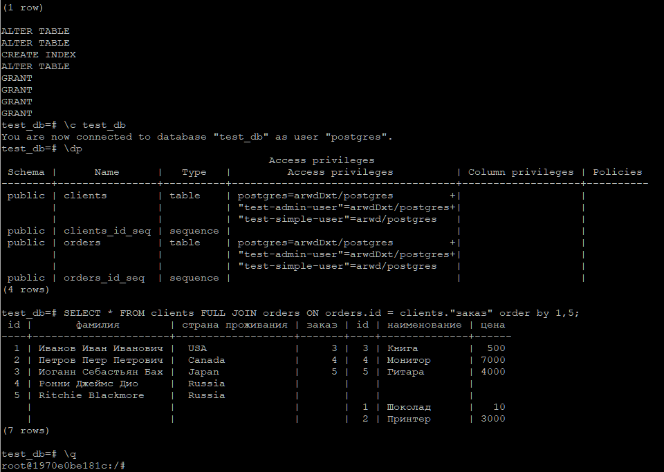

# Домашнее задание к занятию "6.2. SQL"


## Задача 1

**Используя docker поднимите инстанс PostgreSQL (версию 12) c 2 volume,** 
**в который будут складываться данные БД и бэкапы.**

**Приведите получившуюся команду или docker-compose манифест.**

```bash
$ sudo mkdir -p /pg/data-dir
$ sudo mkdir -p /pg/backup-dir
$
$ sudo docker run --name pg-netology -d -p 5432:5432 -e POSTGRES_USER=postgres \
> -e POSTGRES_PASSWORD=postgres -e PGDATA=/var/lib/postgresql/data/pgdata \
> -v /pg/data-dir:/var/lib/postgresql/data -v /pg/backup-dir:/var/lib/postgresql/backup \
> postgres:12-bullseye
b952b7989fd8e7b0080eeb013125c094171a4b617eef17dcd2dc320a3234daa6
$
$ sudo docker ps
CONTAINER ID   IMAGE                  COMMAND                  CREATED          STATUS          PORTS                                       NAMES
b952b7989fd8   postgres:12-bullseye   "docker-entrypoint.s…"   13 seconds ago   Up 12 seconds   0.0.0.0:5432->5432/tcp, :::5432->5432/tcp   pg-netology
```

  


## Задача 2

**В БД из задачи 1:**  
- **создайте пользователя test-admin-user и БД test_db**  
- **в БД test_db создайте таблицу orders и clients (спeцификация таблиц ниже)**  
- **предоставьте привилегии на все операции пользователю test-admin-user на таблицы БД test_db**  
- **создайте пользователя test-simple-user**    
- **предоставьте пользователю test-simple-user права на SELECT/INSERT/UPDATE/DELETE данных таблиц БД test_db**  

**Таблица orders:**  
- **id (serial primary key)**  
- **наименование (string)**  
- **цена (integer)**  

**Таблица clients:**  
- **id (serial primary key)**  
- **фамилия (string)**  
- **страна проживания (string, index)**  
- **заказ (foreign key orders)**  

**Приведите:**  
- **итоговый список БД после выполнения пунктов выше,**  
```
test_db=# \l
                                 List of databases
   Name    |  Owner   | Encoding |  Collate   |   Ctype    |   Access privileges
-----------+----------+----------+------------+------------+-----------------------
 postgres  | postgres | UTF8     | en_US.utf8 | en_US.utf8 |
 template0 | postgres | UTF8     | en_US.utf8 | en_US.utf8 | =c/postgres          +
           |          |          |            |            | postgres=CTc/postgres
 template1 | postgres | UTF8     | en_US.utf8 | en_US.utf8 | =c/postgres          +
           |          |          |            |            | postgres=CTc/postgres
 test_db   | postgres | UTF8     | en_US.utf8 | en_US.utf8 |
(4 rows)

```


- **описание таблиц (describe)**  
```
test_db=#  \d orders
                                      Table "public.orders"
    Column    |         Type          | Collation | Nullable |              Default
--------------+-----------------------+-----------+----------+------------------------------------
 id           | integer               |           | not null | nextval('orders_id_seq'::regclass)
 наименование | character varying(40) |           |          |
 цена         | integer               |           |          |
Indexes:
    "pk_id" PRIMARY KEY, btree (id)
Referenced by:
    TABLE "clients" CONSTRAINT "clients_заказ_fkey" FOREIGN KEY ("заказ") REFERENCES orders(id)

test_db=#  \d clients
                                         Table "public.clients"
      Column       |         Type          | Collation | Nullable |               Default
-------------------+-----------------------+-----------+----------+-------------------------------------
 id                | integer               |           | not null | nextval('clients_id_seq'::regclass)
 фамилия           | character varying(40) |           |          |
 страна проживания | character varying(80) |           |          |
 заказ             | integer               |           |          |
Indexes:
    "pk_clients_id" PRIMARY KEY, btree (id)
    "idx_clients_country" btree ("страна проживания")
Foreign-key constraints:
    "clients_заказ_fkey" FOREIGN KEY ("заказ") REFERENCES orders(id)

test_db=#
```  


- **SQL-запрос для выдачи списка пользователей с правами над таблицами test_db**  

```
SELECT grantee, privilege_type, table_name  FROM information_schema.role_table_grants where table_name IN ('orders','clients');
```

- **список пользователей с правами над таблицами test_db**

```
     grantee      | privilege_type | table_name
------------------+----------------+------------
 postgres         | INSERT         | orders
 postgres         | SELECT         | orders
 postgres         | UPDATE         | orders
 postgres         | DELETE         | orders
 postgres         | TRUNCATE       | orders
 postgres         | REFERENCES     | orders
 postgres         | TRIGGER        | orders
 test-admin-user  | INSERT         | orders
 test-admin-user  | SELECT         | orders
 test-admin-user  | UPDATE         | orders
 test-admin-user  | DELETE         | orders
 test-admin-user  | TRUNCATE       | orders
 test-admin-user  | REFERENCES     | orders
 test-admin-user  | TRIGGER        | orders
 test-simple-user | INSERT         | orders
 test-simple-user | SELECT         | orders
 test-simple-user | UPDATE         | orders
 test-simple-user | DELETE         | orders
 postgres         | INSERT         | clients
 postgres         | SELECT         | clients
 postgres         | UPDATE         | clients
 postgres         | DELETE         | clients
 postgres         | TRUNCATE       | clients
 postgres         | REFERENCES     | clients
 postgres         | TRIGGER        | clients
 test-admin-user  | INSERT         | clients
 test-admin-user  | SELECT         | clients
 test-admin-user  | UPDATE         | clients
 test-admin-user  | DELETE         | clients
 test-admin-user  | TRUNCATE       | clients
 test-admin-user  | REFERENCES     | clients
 test-admin-user  | TRIGGER        | clients
 test-simple-user | INSERT         | clients
 test-simple-user | SELECT         | clients
 test-simple-user | UPDATE         | clients
 test-simple-user | DELETE         | clients
(36 rows)

```

```
test_db=# \dp
                                           Access privileges
 Schema |      Name      |   Type   |         Access privileges          | Column privileges | Policies
--------+----------------+----------+------------------------------------+-------------------+----------
 public | clients        | table    | postgres=arwdDxt/postgres         +|                   |
        |                |          | "test-admin-user"=arwdDxt/postgres+|                   |
        |                |          | "test-simple-user"=arwd/postgres   |                   |
 public | clients_id_seq | sequence |                                    |                   |
 public | orders         | table    | postgres=arwdDxt/postgres         +|                   |
        |                |          | "test-admin-user"=arwdDxt/postgres+|                   |
        |                |          | "test-simple-user"=arwd/postgres   |                   |
 public | orders_id_seq  | sequence |                                    |                   |
(4 rows)
```


## Задача 3

**Используя SQL синтаксис - наполните таблицы следующими тестовыми данными:**  

**Таблица orders** 

|Наименование|цена|
|------------|----|
|Шоколад| 10 |
|Принтер| 3000 |
|Книга| 500 |
|Монитор| 7000|
|Гитара| 4000|

**Таблица clients**

|ФИО|Страна проживания|
|------------|----|
|Иванов Иван Иванович| USA |
|Петров Петр Петрович| Canada |
|Иоганн Себастьян Бах| Japan |
|Ронни Джеймс Дио| Russia|
|Ritchie Blackmore| Russia|

**Используя SQL синтаксис:**  
- **вычислите количество записей для каждой таблицы**   
- **приведите в ответе:**  
    - **запросы**   
    - **результаты их выполнения.**  

```
test_db=# select count(*) from orders;
 count
-------
     5
(1 row)
test_db=# select count(*) from clients;
 count
-------
     5
(1 row)
```


## Задача 4

**Часть пользователей из таблицы clients решили оформить заказы из таблицы orders.**  

**Используя foreign keys свяжите записи из таблиц, согласно таблице:**  

|ФИО|Заказ|
|------------|----|
|Иванов Иван Иванович| Книга |
|Петров Петр Петрович| Монитор |
|Иоганн Себастьян Бах| Гитара |

**Приведите SQL-запросы для выполнения данных операций.**  

**Приведите SQL-запрос для выдачи всех пользователей, которые совершили заказ, а также вывод данного запроса.**  
 
**Подсказк - используйте директиву `UPDATE`.**  

```
test_db=# UPDATE clients SET "заказ" = 3  WHERE id = 1;
UPDATE 1
test_db=# UPDATE clients SET "заказ" = 4  WHERE id = 2;
UPDATE 1
test_db=# UPDATE clients SET "заказ" = 5  WHERE id = 3;
UPDATE 1
test_db=# SELECT "фамилия", "наименование"  FROM clients INNER JOIN orders ON orders.id = clients."заказ";
       фамилия        | наименование
----------------------+--------------
 Иванов Иван Иванович | Книга
 Петров Петр Петрович | Монитор
 Иоганн Себастьян Бах | Гитара
(3 rows)

```


## Задача 5

**Получите полную информацию по выполнению запроса выдачи всех пользователей из задачи 4** 
**(используя директиву EXPLAIN).**

**Приведите получившийся результат и объясните что значат полученные значения.**

```
test_db=# EXPLAIN (ANALYZE) SELECT "фамилия" FROM clients INNER JOIN orders ON orders.id = clients."заказ";
                                                  QUERY PLAN
---------------------------------------------------------------------------------------------------------------
 Hash Join  (cost=23.50..36.78 rows=260 width=98) (actual time=0.049..0.055 rows=3 loops=1)
   Hash Cond: (clients."заказ" = orders.id)
   ->  Seq Scan on clients  (cost=0.00..12.60 rows=260 width=102) (actual time=0.016..0.018 rows=5 loops=1)
   ->  Hash  (cost=16.00..16.00 rows=600 width=4) (actual time=0.017..0.018 rows=5 loops=1)
         Buckets: 1024  Batches: 1  Memory Usage: 9kB
         ->  Seq Scan on orders  (cost=0.00..16.00 rows=600 width=4) (actual time=0.007..0.010 rows=5 loops=1)
 Planning Time: 0.261 ms
 Execution Time: 0.098 ms
(8 rows)

```


Сначала последовательно просматривается таблица **orders** (`Seq Scan on orders`) и для каждой её строки вычисляется хэш (`Hash`).  
Затем просматривается таблица **clients** (`Seq Scan on clients`) и для каждой строки этой таблицы вычисляется хэш,   
который сравнивается (`Hash Join`) с хэшем таблицы **orders** по условию `Hash Cond: (clients."заказ" = orders.id)`.   
Если соответствие найдено, то выводится результирующая строка, иначе строка будет пропущена.

`Memory Usage: 9kB` -- использовано `9kB` в памяти для размещения хэшей таблицы **orders**  
`cost=16.00..16.00` -- стоимость получения первой строки `16.00` и всех строк `16.00`
`rows` -- приблизительное количество возвращаемых строк  
`width` -- средний размер одной строки в байтах.  
`actual time=0.017..0.018` -- реальное время в миллисекундах, затраченное для получения первой строки `0.017` и всех строк `0.018`   
`rows` — реальное количество строк, полученных при Seq Scan   
`loops` — сколько раз пришлось выполнить операцию Seq Scan  
`Planning Time: 0.261 ms` -- планируемое время выполнения запроса    
`Execution Time: 0.098 ms` -- фактическое время выполнения запроса   


## Задача 6

**Создайте бэкап БД test_db и поместите его в volume, предназначенный для бэкапов (см. Задачу 1).**  

**Остановите контейнер с PostgreSQL (но не удаляйте volumes).**  

**Поднимите новый пустой контейнер с PostgreSQL.**  

**Восстановите БД test_db в новом контейнере.**  

**Приведите список операций, который вы применяли для бэкапа данных и восстановления.**   

---
**Бэкап:**  

```
rootit@pc377u:~$ ls -l /pg/backup-dir
total 0
rootit@pc377u:~$ sudo docker exec -it pg-netology pg_dump -U postgres -C -Fp -f /var/lib/postgresql/backup/test_db.backup test_db
rootit@pc377u:~$ ls -l /pg/backup-dir
total 8
-rw-r--r-- 1 root root 5120 фев 25 12:00 test_db.backup
rootit@pc377u:~$ sudo docker stop pg-netology
pg-netology
```


**Восстановление:** 


```
rootit@pc377u:~$ sudo docker ps
CONTAINER ID   IMAGE     COMMAND   CREATED   STATUS    PORTS     NAMES
rootit@pc377u:~$ sudo docker run --name pg-restore -d -e POSTGRES_USER=postgres -e POSTGRES_PASSWORD=postgres \
> -v /pg/backup-dir:/var/lib/postgresql/backup postgres:13-bullseye
1970e0be181c7c827bee5c6105e17b2c5b39ef588ed4e80a33d75816d5b3e3f2
rootit@pc377u:~$ sudo docker ps
CONTAINER ID   IMAGE                  COMMAND                  CREATED         STATUS         PORTS      NAMES
1970e0be181c   postgres:13-bullseye   "docker-entrypoint.s…"   6 seconds ago   Up 5 seconds   5432/tcp   pg-restore
rootit@pc377u:~$ sudo docker exec -it pg-restore bash
root@1970e0be181c:/# psql -U postgres
psql (13.6 (Debian 13.6-1.pgdg110+1))
Type "help" for help.

postgres=# CREATE ROLE "test-admin-user" LOGIN;
CREATE ROLE
postgres=# CREATE ROLE "test-simple-user" LOGIN;
CREATE ROLE
postgres=# \i /var/lib/postgresql/backup/test_db.backup
SET
SET
...
...
...
GRANT
GRANT
test_db=# \c test_db
You are now connected to database "test_db" as user "postgres".
test_db=# \dp
                                           Access privileges
 Schema |      Name      |   Type   |         Access privileges          | Column privileges | Policies
--------+----------------+----------+------------------------------------+-------------------+----------
 public | clients        | table    | postgres=arwdDxt/postgres         +|                   |
        |                |          | "test-admin-user"=arwdDxt/postgres+|                   |
        |                |          | "test-simple-user"=arwd/postgres   |                   |
 public | clients_id_seq | sequence |                                    |                   |
 public | orders         | table    | postgres=arwdDxt/postgres         +|                   |
        |                |          | "test-admin-user"=arwdDxt/postgres+|                   |
        |                |          | "test-simple-user"=arwd/postgres   |                   |
 public | orders_id_seq  | sequence |                                    |                   |
(4 rows)

test_db=# SELECT * FROM clients FULL JOIN orders ON orders.id = clients."заказ" order by 1,5;
 id |       фамилия        | страна проживания | заказ | id | наименование | цена
----+----------------------+-------------------+-------+----+--------------+------
  1 | Иванов Иван Иванович |  USA              |     3 |  3 | Книга        |  500
  2 | Петров Петр Петрович |  Canada           |     4 |  4 | Монитор      | 7000
  3 | Иоганн Себастьян Бах |  Japan            |     5 |  5 | Гитара       | 4000
  4 | Ронни Джеймс Дио     |  Russia           |       |    |              |
  5 | Ritchie Blackmore    |  Russia           |       |    |              |
    |                      |                   |       |  1 | Шоколад      |   10
    |                      |                   |       |  2 | Принтер      | 3000
(7 rows)

test_db=# \q
root@1970e0be181c:/#
```


...



