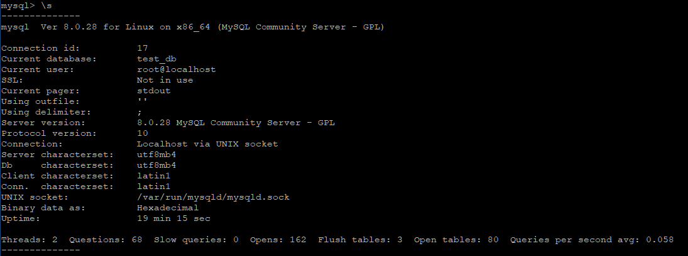
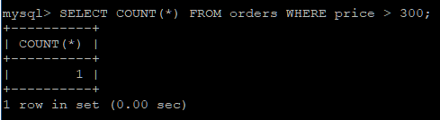
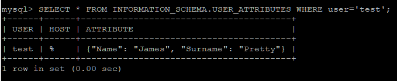
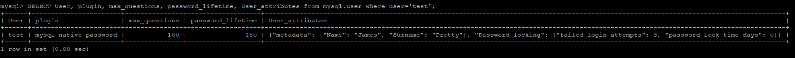
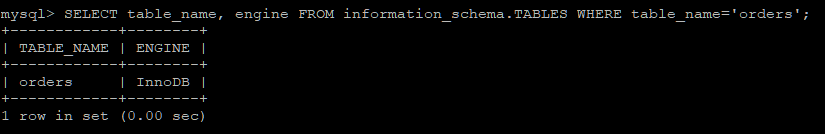
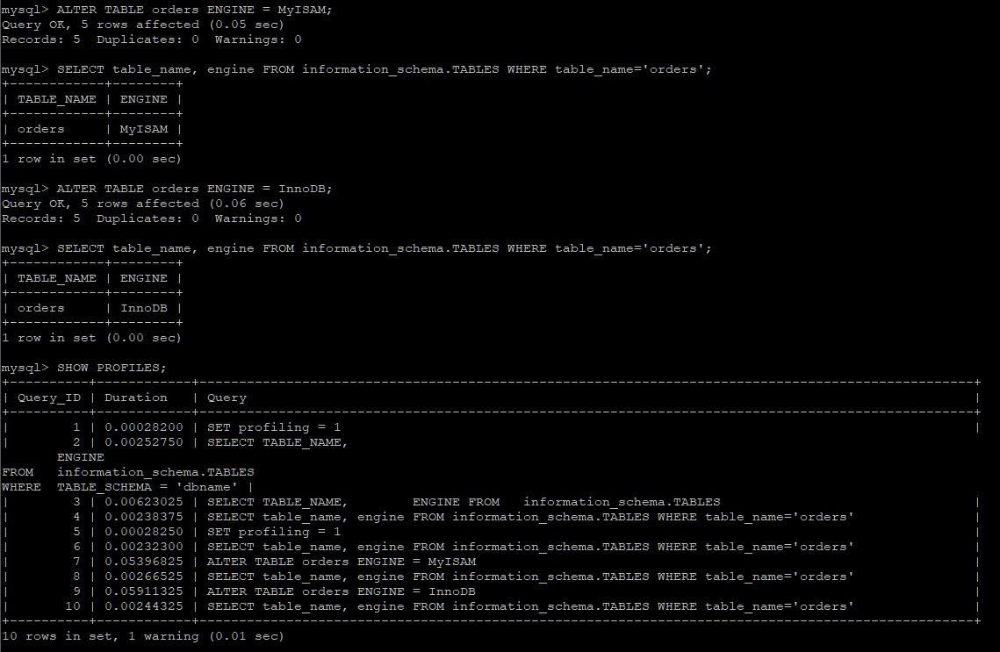
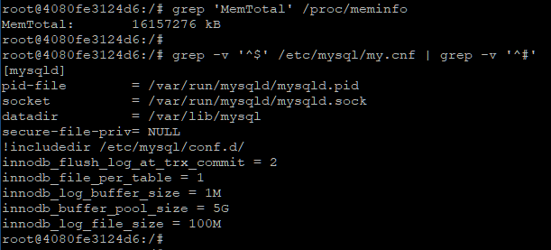

# Домашнее задание к занятию "6.3. MySQL"

---
## Задача 1

Используя docker поднимите инстанс MySQL (версию 8). Данные БД сохраните в volume.

Изучите [бэкап БД](https://github.com/netology-code/virt-homeworks/tree/master/06-db-03-mysql/test_data) и 
восстановитесь из него.

Перейдите в управляющую консоль `mysql` внутри контейнера.

Используя команду `\h` получите список управляющих команд.

Найдите команду для выдачи статуса БД и **приведите в ответе** из ее вывода версию сервера БД.

Подключитесь к восстановленной БД и получите список таблиц из этой БД.

**Приведите в ответе** количество записей с `price` > 300.

В следующих заданиях мы будем продолжать работу с данным контейнером.


---
**Ответ:**  

```
mysql> \s
--------------
mysql  Ver 8.0.28 for Linux on x86_64 (MySQL Community Server - GPL)

Connection id:          17
Current database:       test_db
Current user:           root@localhost
SSL:                    Not in use
Current pager:          stdout
Using outfile:          ''
Using delimiter:        ;
Server version:         8.0.28 MySQL Community Server - GPL
Protocol version:       10
Connection:             Localhost via UNIX socket
Server characterset:    utf8mb4
Db     characterset:    utf8mb4
Client characterset:    latin1
Conn.  characterset:    latin1
UNIX socket:            /var/run/mysqld/mysqld.sock
Binary data as:         Hexadecimal
Uptime:                 19 min 15 sec

Threads: 2  Questions: 68  Slow queries: 0  Opens: 162  Flush tables: 3  Open tables: 80  Queries per second avg: 0.058
--------------
```



Одна запись с `price` > 300  



---
## Задача 2

Создайте пользователя test в БД c паролем test-pass, используя:
- плагин авторизации mysql_native_password
- срок истечения пароля - 180 дней 
- количество попыток авторизации - 3 
- максимальное количество запросов в час - 100
- аттрибуты пользователя:
    - Фамилия "Pretty"
    - Имя "James"

Предоставьте привелегии пользователю `test` на операции SELECT базы `test_db`.
    
Используя таблицу INFORMATION_SCHEMA.USER_ATTRIBUTES получите данные по пользователю `test` и 
**приведите в ответе к задаче**.


---
**Ответ:**  

```
mysql> SELECT * FROM INFORMATION_SCHEMA.USER_ATTRIBUTES WHERE user='test';
+------+------+----------------------------------------+
| USER | HOST | ATTRIBUTE                              |
+------+------+----------------------------------------+
| test | %    | {"Name": "James", "Surname": "Pretty"} |
+------+------+----------------------------------------+
1 row in set (0.00 sec)
```



```
mysql> SELECT User, plugin, max_questions, password_lifetime, User_attributes from mysql.user where user='test';
+------+-----------------------+---------------+-------------------+--------------------------------------------------------------------------------------------------------------------------------------+
| User | plugin                | max_questions | password_lifetime | User_attributes                                                                                                                      |
+------+-----------------------+---------------+-------------------+--------------------------------------------------------------------------------------------------------------------------------------+
| test | mysql_native_password |           100 |               180 | {"metadata": {"Name": "James", "Surname": "Pretty"}, "Password_locking": {"failed_login_attempts": 3, "password_lock_time_days": 0}} |
+------+-----------------------+---------------+-------------------+--------------------------------------------------------------------------------------------------------------------------------------+
1 row in set (0.00 sec)

```




---

## Задача 3

Установите профилирование `SET profiling = 1`.
Изучите вывод профилирования команд `SHOW PROFILES;`.

Исследуйте, какой `engine` используется в таблице БД `test_db` и **приведите в ответе**.

Измените `engine` и **приведите время выполнения и запрос на изменения из профайлера в ответе**:
- на `MyISAM`
- на `InnoDB`

---
**Ответ:**  

```
mysql> SELECT table_name, engine FROM information_schema.TABLES WHERE table_name='orders';
+------------+--------+
| TABLE_NAME | ENGINE |
+------------+--------+
| orders     | InnoDB |
+------------+--------+
1 row in set (0.00 sec)
```



```
mysql> SHOW PROFILES;
+----------+------------+--------------------------------------------------------------------------------------------------+
| Query_ID | Duration   | Query                                                                                            |
+----------+------------+--------------------------------------------------------------------------------------------------+
|        7 | 0.05396825 | ALTER TABLE orders ENGINE = MyISAM                                                               |
|        9 | 0.05911325 | ALTER TABLE orders ENGINE = InnoDB                                                               |
+----------+------------+--------------------------------------------------------------------------------------------------+
```




---


## Задача 4 

Изучите файл `my.cnf` в директории /etc/mysql.

Измените его согласно ТЗ (движок InnoDB):
- Скорость IO важнее сохранности данных
- Нужна компрессия таблиц для экономии места на диске
- Размер буффера с незакомиченными транзакциями 1 Мб
- Буффер кеширования 30% от ОЗУ
- Размер файла логов операций 100 Мб

Приведите в ответе измененный файл `my.cnf`.


---
**Ответ:**  
```
innodb_flush_log_at_trx_commit = 2
innodb_file_per_table = 1
innodb_log_buffer_size = 1M
innodb_buffer_pool_size = 5G
innodb_log_file_size = 100M
```



```
mysql> SHOW VARIABLES LIKE 'innodb_%';
+------------------------------------------+------------------------+
| Variable_name                            | Value                  |
+------------------------------------------+------------------------+
| innodb_buffer_pool_size                  | 5368709120             |
| innodb_file_per_table                    | ON                     |
| innodb_flush_log_at_trx_commit           | 2                      |
| innodb_log_buffer_size                   | 1048576                |
| innodb_log_file_size                     | 104857600              |
+------------------------------------------+------------------------+
150 rows in set (0.01 sec)
```