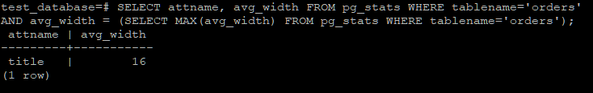
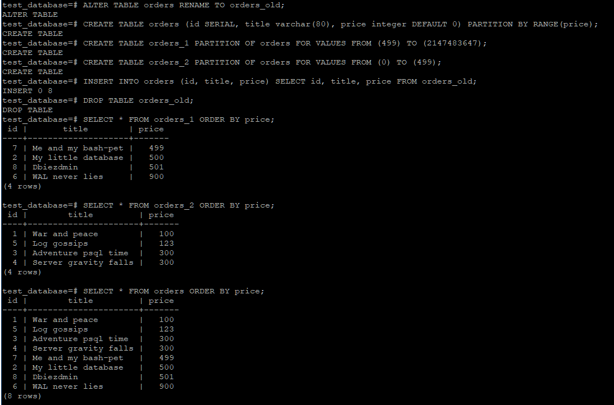
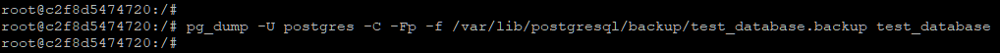

# Домашнее задание к занятию "6.4. PostgreSQL"

---

## Задача 1

Используя docker поднимите инстанс PostgreSQL (версию 13). Данные БД сохраните в volume.

Подключитесь к БД PostgreSQL используя `psql`.

Воспользуйтесь командой `\?` для вывода подсказки по имеющимся в `psql` управляющим командам.

**Найдите и приведите** управляющие команды для:
- вывода списка БД
- подключения к БД
- вывода списка таблиц
- вывода описания содержимого таблиц
- выхода из psql


---
**Ответ:**

- вывод списка БД  
  ```\l[+]   [PATTERN]      list databases```  
- подключение к БД  
   ```\c[onnect] {[DBNAME|- USER|- HOST|- PORT|-] | conninfo}       connect to new database```
- вывод списка таблиц  
  ``` \dt[S+] [PATTERN]      list tables```  
- вывод описания содержимого таблиц  
  ```\d[S+]  NAME           describe table, view, sequence, or index```  
- выход из psql  
  ```\q                     quit psql```  

---
## Задача 2

Используя `psql` создайте БД `test_database`.

Изучите [бэкап БД](https://github.com/netology-code/virt-homeworks/tree/master/06-db-04-postgresql/test_data).

Восстановите бэкап БД в `test_database`.

Перейдите в управляющую консоль `psql` внутри контейнера.

Подключитесь к восстановленной БД и проведите операцию ANALYZE для сбора статистики по таблице.

Используя таблицу [pg_stats](https://postgrespro.ru/docs/postgresql/12/view-pg-stats), найдите столбец таблицы `orders` 
с наибольшим средним значением размера элементов в байтах.

**Приведите в ответе** команду, которую вы использовали для вычисления и полученный результат.

---

**Ответ:**

```
test_database=# SELECT attname, avg_width FROM pg_stats WHERE tablename='orders'
AND avg_width = (SELECT MAX(avg_width) FROM pg_stats WHERE tablename='orders');
 attname | avg_width
---------+-----------
 title   |        16
(1 row)
```



---


## Задача 3

Архитектор и администратор БД выяснили, что ваша таблица orders разрослась до невиданных размеров и
поиск по ней занимает долгое время. Вам, как успешному выпускнику курсов DevOps в нетологии предложили
провести разбиение таблицы на 2 (шардировать на orders_1 - price>499 и orders_2 - price<=499).

Предложите SQL-транзакцию для проведения данной операции.

Можно ли было изначально исключить "ручное" разбиение при проектировании таблицы orders?

---

**Ответ:**


```
test_database=# ALTER TABLE orders RENAME TO orders_old;
ALTER TABLE
test_database=# CREATE TABLE orders (id SERIAL, title varchar(80), price integer DEFAULT 0) PARTITION BY RANGE(price);
CREATE TABLE
test_database=# CREATE TABLE orders_1 PARTITION OF orders FOR VALUES FROM (499) TO (2147483647);
CREATE TABLE
test_database=# CREATE TABLE orders_2 PARTITION OF orders FOR VALUES FROM (0) TO (499);
CREATE TABLE
test_database=# INSERT INTO orders (id, title, price) SELECT id, title, price FROM orders_old;
INSERT 0 8
test_database=# DROP TABLE orders_old;
DROP TABLE
```





**Можно было исключить "ручное" разбиение таблицы `orders`.**


---


## Задача 4

Используя утилиту `pg_dump` создайте бекап БД `test_database`.

Как бы вы доработали бэкап-файл, чтобы добавить уникальность значения столбца `title` для таблиц `test_database`?

---

**Ответ:**

```
root@c2f8d5474720:/# pg_dump -U postgres -C -Fp -f /var/lib/postgresql/backup/test_database.backup test_database

```




Добавил бы в конце файла `test_database.backup` строку:
```
ALTER TABLE public.orders ADD CONSTRAINT orders_title_unique UNIQUE (title, price);
```


