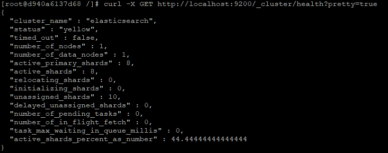

# Домашнее задание к занятию "6.5. Elasticsearch"

## Задача 1

В этом задании вы потренируетесь в:
- установке elasticsearch
- первоначальном конфигурировании elastcisearch
- запуске elasticsearch в docker

Используя докер образ [centos:7](https://hub.docker.com/_/centos) как базовый и 
[документацию по установке и запуску Elastcisearch](https://www.elastic.co/guide/en/elasticsearch/reference/current/targz.html):

- составьте Dockerfile-манифест для elasticsearch
- соберите docker-образ и сделайте `push` в ваш docker.io репозиторий
- запустите контейнер из получившегося образа и выполните запрос пути `/` c хост-машины

Требования к `elasticsearch.yml`:
- данные `path` должны сохраняться в `/var/lib`
- имя ноды должно быть `netology_test`

В ответе приведите:
- текст Dockerfile манифеста
- ссылку на образ в репозитории dockerhub
- ответ `elasticsearch` на запрос пути `/` в json виде

Подсказки:
- возможно вам понадобится установка пакета perl-Digest-SHA для корректной работы пакета shasum
- при сетевых проблемах внимательно изучите кластерные и сетевые настройки в elasticsearch.yml
- при некоторых проблемах вам поможет docker директива ulimit
- elasticsearch в логах обычно описывает проблему и пути ее решения

Далее мы будем работать с данным экземпляром elasticsearch.

---

### Ответ:

**Текст Dockerfile манифеста:**  
```
FROM centos:7

RUN yum install perl-Digest-SHA -y

RUN curl https://artifacts.elastic.co/downloads/elasticsearch/elasticsearch-8.0.1-linux-x86_64.tar.gz \
         -o elasticsearch-8.0.1-linux-x86_64.tar.gz && \
    curl https://artifacts.elastic.co/downloads/elasticsearch/elasticsearch-8.0.1-linux-x86_64.tar.gz.sha512 \
         -o elasticsearch-8.0.1-linux-x86_64.tar.gz.sha512 && \
    shasum -a 512 -c elasticsearch-8.0.1-linux-x86_64.tar.gz.sha512 && \
    tar -xzf elasticsearch-8.0.1-linux-x86_64.tar.gz && \
    rm -f elasticsearch-8.0.1-linux-x86_64.tar.gz && \
    rm -f elasticsearch-8.0.1-linux-x86_64.tar.gz.sha512

RUN mkdir -p /var/lib/elasticsearch/data && \
    mkdir -p /var/lib/elasticsearch/logs && \
    adduser elasticsearch && \
    chown -R elasticsearch /elasticsearch-8.0.1 && \
    chown -R elasticsearch /var/lib/elasticsearch

RUN echo 'node.name: netology_test' > /elasticsearch-8.0.1/config/elasticsearch.yml && \
    echo 'discovery.type: single-node' >> /elasticsearch-8.0.1/config/elasticsearch.yml && \
    echo 'path.data: /var/lib/elasticsearch/data' >> /elasticsearch-8.0.1/config/elasticsearch.yml && \
    echo 'path.logs: /var/lib/elasticsearch/logs' >> /elasticsearch-8.0.1/config/elasticsearch.yml && \
    echo 'network.host: 0.0.0.0' >> /elasticsearch-8.0.1/config/elasticsearch.yml && \
    echo 'xpack.security.enabled: false' >> /elasticsearch-8.0.1/config/elasticsearch.yml

WORKDIR /elasticsearch-8.0.1

CMD su -c "/elasticsearch-8.0.1/bin/elasticsearch" elasticsearch
```

**Ссылка на образ в репозитории dockerhub:**    
https://hub.docker.com/r/murcidus/elasticsearch-netology

  


**Ответ `elasticsearch` на запрос пути `/` в json виде:**  
```
[root@d940a6137d68 /]# curl -X GET http://127.0.0.1:9200/
{
  "name" : "netology_test",
  "cluster_name" : "elasticsearch",
  "cluster_uuid" : "kfhVrnAaQRqS5OwUG0v-yg",
  "version" : {
    "number" : "8.0.1",
    "build_flavor" : "default",
    "build_type" : "tar",
    "build_hash" : "801d9ccc7c2ee0f2cb121bbe22ab5af77a902372",
    "build_date" : "2022-02-24T13:55:40.601285296Z",
    "build_snapshot" : false,
    "lucene_version" : "9.0.0",
    "minimum_wire_compatibility_version" : "7.17.0",
    "minimum_index_compatibility_version" : "7.0.0"
  },
  "tagline" : "You Know, for Search"
}
```
  

---

## Задача 2

В этом задании вы научитесь:
- создавать и удалять индексы
- изучать состояние кластера
- обосновывать причину деградации доступности данных

Ознакомтесь с [документацией](https://www.elastic.co/guide/en/elasticsearch/reference/current/indices-create-index.html) 
и добавьте в `elasticsearch` 3 индекса, в соответствии со таблицей:

| Имя | Количество реплик | Количество шард |
|-----|-------------------|-----------------|
| ind-1| 0 | 1 |
| ind-2 | 1 | 2 |
| ind-3 | 2 | 4 |

Получите список индексов и их статусов, используя API и **приведите в ответе** на задание.

Получите состояние кластера `elasticsearch`, используя API.

Как вы думаете, почему часть индексов и кластер находится в состоянии yellow?

Удалите все индексы.

**Важно**

При проектировании кластера elasticsearch нужно корректно рассчитывать количество реплик и шард,
иначе возможна потеря данных индексов, вплоть до полной, при деградации системы.

---

### Ответ:

**Список индексов и их статусов:**  
```
[root@d940a6137d68 /]# curl -X GET http://localhost:9200/_cat/indices?v
health status index uuid                   pri rep docs.count docs.deleted store.size pri.store.size
green  open   ind-1 vCzxuWChTdWo8t3qs8TpMw   1   0          0            0       225b           225b
yellow open   ind-3 vtm_m4RtSRO__y81Kp1IRA   4   2          0            0       900b           900b
yellow open   ind-2 q9w6XejfRAG6ciGcHcogcQ   2   1          0            0       450b           450b
```
    

**Состояние кластера:**    
```
[root@d940a6137d68 /]# curl -X GET http://localhost:9200/_cluster/health?pretty=true
{
  "cluster_name" : "elasticsearch",
  "status" : "yellow",
  "timed_out" : false,
  "number_of_nodes" : 1,
  "number_of_data_nodes" : 1,
  "active_primary_shards" : 8,
  "active_shards" : 8,
  "relocating_shards" : 0,
  "initializing_shards" : 0,
  "unassigned_shards" : 10,
  "delayed_unassigned_shards" : 0,
  "number_of_pending_tasks" : 0,
  "number_of_in_flight_fetch" : 0,
  "task_max_waiting_in_queue_millis" : 0,
  "active_shards_percent_as_number" : 44.44444444444444
}
```
  

_**Часть индексов и кластер находится в состоянии `yellow` потому, что у индексов `ind-2` и `ind-3` недоступны реплики, 
т.к. у нас всего один узел в кластере.**_

**Удалил индексы:**  
```
curl -X DELETE http://localhost:9200/ind-1
curl -X DELETE http://localhost:9200/ind-2
curl -X DELETE http://localhost:9200/ind-3
```

---


## Задача 3

В данном задании вы научитесь:
- создавать бэкапы данных
- восстанавливать индексы из бэкапов

Создайте директорию `{путь до корневой директории с elasticsearch в образе}/snapshots`.

Используя API [зарегистрируйте](https://www.elastic.co/guide/en/elasticsearch/reference/current/snapshots-register-repository.html#snapshots-register-repository) 
данную директорию как `snapshot repository` c именем `netology_backup`.

**Приведите в ответе** запрос API и результат вызова API для создания репозитория.

Создайте индекс `test` с 0 реплик и 1 шардом и **приведите в ответе** список индексов.

[Создайте `snapshot`](https://www.elastic.co/guide/en/elasticsearch/reference/current/snapshots-take-snapshot.html) 
состояния кластера `elasticsearch`.

**Приведите в ответе** список файлов в директории со `snapshot`ами.

Удалите индекс `test` и создайте индекс `test-2`. **Приведите в ответе** список индексов.

[Восстановите](https://www.elastic.co/guide/en/elasticsearch/reference/current/snapshots-restore-snapshot.html) состояние
кластера `elasticsearch` из `snapshot`, созданного ранее. 

**Приведите в ответе** запрос к API восстановления и итоговый список индексов.

Подсказки:
- возможно вам понадобится доработать `elasticsearch.yml` в части директивы `path.repo` и перезапустить `elasticsearch`

---

### Ответ:

**Создание репозитория:**  
```
[root@4360f00a1607 /]# curl -X PUT -H "Content-Type: application/json" http://localhost:9200/_snapshot/netology_backup?pretty=true -d '{
>   "type": "fs",
>   "settings": {
>     "location": "/elasticsearch-8.0.1/snapshots"
>   }
> }'
{
  "acknowledged" : true
}
```
  

**Список индексов:** 
```
[root@4360f00a1607 /]# curl -X GET http://localhost:9200/_cat/indices?v
health status index uuid                   pri rep docs.count docs.deleted store.size pri.store.size
green  open   test  TFA1HV_rRwWuWa_u_yu-qg   1   0          0            0       225b           225b
```
  


**Список файлов в директории со snapshot-ами:**  
```
[root@4360f00a1607 /]# ls -ls /elasticsearch-8.0.1/snapshots
total 36
 4 -rw-r--r-- 1 elasticsearch elasticsearch   844 Mar 10 16:21 index-0
 4 -rw-r--r-- 1 elasticsearch elasticsearch     8 Mar 10 16:21 index.latest
 4 drwxr-xr-x 4 elasticsearch elasticsearch  4096 Mar 10 16:21 indices
20 -rw-r--r-- 1 elasticsearch elasticsearch 17477 Mar 10 16:21 meta-HysFvyf8Ta-BNVsYKo290w.dat
 4 -rw-r--r-- 1 elasticsearch elasticsearch   355 Mar 10 16:21 snap-HysFvyf8Ta-BNVsYKo290w.dat
```
  


**Список индексов:** 
```
[root@4360f00a1607 /]# curl -X GET http://localhost:9200/_cat/indices?v
health status index  uuid                   pri rep docs.count docs.deleted store.size pri.store.size
green  open   test-2 4rv-sEhJTa2xxcBNnX4FgQ   1   0          0            0       225b           225b
```

  


**Запрос к API восстановления и итоговый список индексов:**  
```
[root@4360f00a1607 /]# curl -X POST http://localhost:9200/_snapshot/netology_backup/my_snapshot/_restore?pretty=true
{
  "accepted" : true
}
[root@4360f00a1607 /]# curl -X GET http://localhost:9200/_cat/indices?v
health status index  uuid                   pri rep docs.count docs.deleted store.size pri.store.size
green  open   test-2 4rv-sEhJTa2xxcBNnX4FgQ   1   0          0            0       225b           225b
green  open   test   t-hQQoG0Ryuht8R-Mgt87A   1   0          0            0       225b           225b
[root@4360f00a1607 /]#
```

  


---