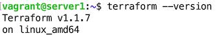
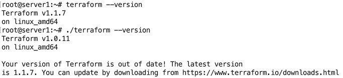
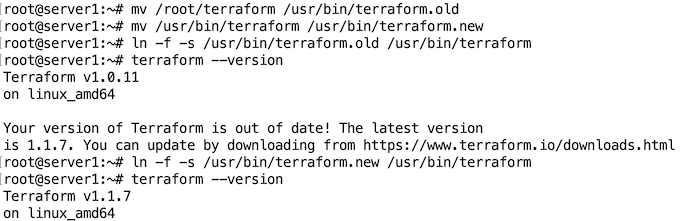

# Домашнее задание к занятию "7.1. Инфраструктура как код"

## Задача 1. Выбор инструментов. 
 
### Легенда
 
Через час совещание на котором менеджер расскажет о новом проекте. Начать работу над которым надо 
будет уже сегодня. 
На данный момент известно, что это будет сервис, который ваша компания будет предоставлять внешним заказчикам.
Первое время, скорее всего, будет один внешний клиент, со временем внешних клиентов станет больше.

Так же по разговорам в компании есть вероятность, что техническое задание еще не четкое, что приведет к большому
количеству небольших релизов, тестирований интеграций, откатов, доработок, то есть скучно не будет.  
   
Вам, как девопс инженеру, будет необходимо принять решение об инструментах для организации инфраструктуры.
На данный момент в вашей компании уже используются следующие инструменты: 
- остатки Сloud Formation, 
- некоторые образы сделаны при помощи Packer,
- год назад начали активно использовать Terraform, 
- разработчики привыкли использовать Docker, 
- уже есть большая база Kubernetes конфигураций, 
- для автоматизации процессов используется Teamcity, 
- также есть совсем немного Ansible скриптов, 
- и ряд bash скриптов для упрощения рутинных задач.  

Для этого в рамках совещания надо будет выяснить подробности о проекте, что бы в итоге определиться с инструментами:

1. Какой тип инфраструктуры будем использовать для этого проекта: изменяемый или не изменяемый?
1. Будет ли центральный сервер для управления инфраструктурой?
1. Будут ли агенты на серверах?
1. Будут ли использованы средства для управления конфигурацией или инициализации ресурсов? 
 
В связи с тем, что проект стартует уже сегодня, в рамках совещания надо будет определиться со всеми этими вопросами.

### В результате задачи необходимо

1. Ответить на четыре вопроса представленных в разделе "Легенда". 
1. Какие инструменты из уже используемых вы хотели бы использовать для нового проекта? 
1. Хотите ли рассмотреть возможность внедрения новых инструментов для этого проекта? 

Если для ответа на эти вопросы недостаточно информации, то напишите какие моменты уточните на совещании.

---
### Ответ


1. Ответить на четыре вопроса представленных в разделе "Легенда".  
1.1. Какой тип инфраструктуры будем использовать для этого проекта: изменяемый или не изменяемый?  
**Изменяемый**  
1.2. Будет ли центральный сервер для управления инфраструктурой?  
**Нет**  
1.3. Будут ли агенты на серверах?  
**Нет**  
1.4. Будут ли использованы средства для управления конфигурацией или инициализации ресурсов?  
**Будут использованы средства для управления конфигурацией**  
2. Какие инструменты из уже используемых вы хотели бы использовать для нового проекта?  
**Docker, Kubernetes, Teamcity, Ansible**   
3. Хотите ли рассмотреть возможность внедрения новых инструментов для этого проекта?  
**Нет**  


---


## Задача 2. Установка терраформ. 

Официальный сайт: https://www.terraform.io/

Установите терраформ при помощи менеджера пакетов используемого в вашей операционной системе.
В виде результата этой задачи приложите вывод команды `terraform --version`.

---
### Ответ



```
vagrant@server1:~$ curl -fsSL https://apt.releases.hashicorp.com/gpg | sudo apt-key add -
OK
vagrant@server1:~$ sudo apt-add-repository "deb [arch=amd64] https://apt.releases.hashicorp.com $(lsb_release -cs) main"
Hit:1 http://archive.ubuntu.com/ubuntu focal InRelease                                                                               
...
Fetched 65.0 kB in 1s (47.0 kB/s)   
Reading package lists... Done
vagrant@server1:~$ sudo apt-get update && sudo apt-get install terraform
Hit:1 http://archive.ubuntu.com/ubuntu focal InRelease
...
Unpacking terraform (1.1.7) ...
Setting up terraform (1.1.7) ...
vagrant@server1:~$ terraform --version
Terraform v1.1.7
on linux_amd64
vagrant@server1:~$ 
```

---

## Задача 3. Поддержка легаси кода. 

В какой-то момент вы обновили терраформ до новой версии, например с 0.12 до 0.13. 
А код одного из проектов настолько устарел, что не может работать с версией 0.13. 
В связи с этим необходимо сделать так, чтобы вы могли одновременно использовать последнюю версию терраформа установленную при помощи
штатного менеджера пакетов и устаревшую версию 0.12. 

В виде результата этой задачи приложите вывод `--version` двух версий терраформа доступных на вашем компьютере 
или виртуальной машине.

---
### Ответ

К разным версиям терраформа можно обращаться, указывая расположение файла:



```
root@server1:~# terraform --version
Terraform v1.1.7
on linux_amd64
root@server1:~# ./terraform --version
Terraform v1.0.11
on linux_amd64

Your version of Terraform is out of date! The latest version
is 1.1.7. You can update by downloading from https://www.terraform.io/downloads.html
```
или, пересоздавая символическую ссылку:



```
root@server1:~# mv /root/terraform /usr/bin/terraform.old
root@server1:~# mv /usr/bin/terraform /usr/bin/terraform.new
root@server1:~# ln -f -s /usr/bin/terraform.old /usr/bin/terraform
root@server1:~# terraform --version
Terraform v1.0.11
on linux_amd64

Your version of Terraform is out of date! The latest version
is 1.1.7. You can update by downloading from https://www.terraform.io/downloads.html
root@server1:~# ln -f -s /usr/bin/terraform.new /usr/bin/terraform
root@server1:~# terraform --version
Terraform v1.1.7
on linux_amd64
```
